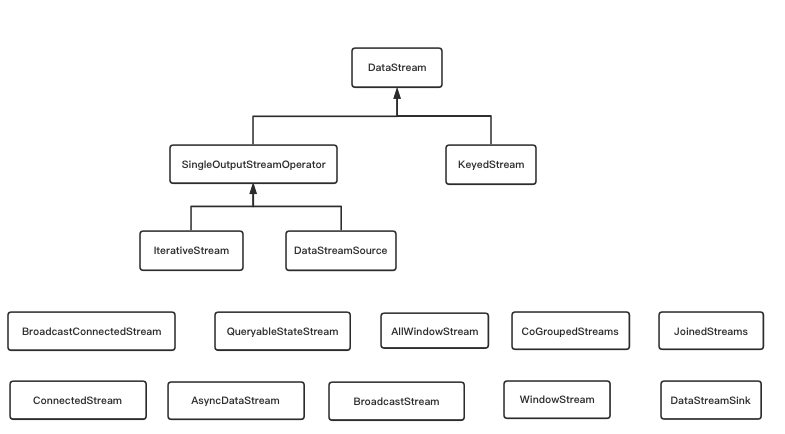
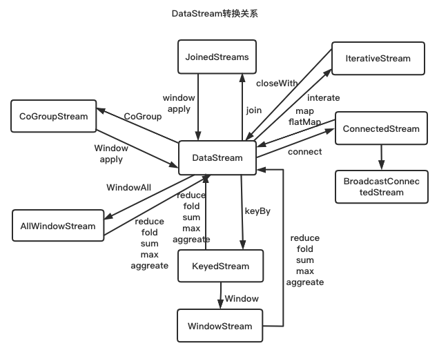
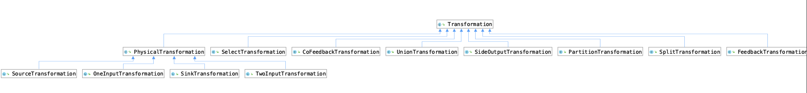

# DataStream体系&Transformation体系  
## DataStream体系  
### DataStream介绍  
DataStream是Flink数据流核心抽象，其上定义了数据流的一系列操作，同时也定义了
与其他DataStream的相互转换关系，每个DataStream都有一个Transformation对象，表示
该DataStream从上游DataStream使用该Transformation转换而来，；  
  
1. DataStream  
DataStream是Flink数据的核心抽象抽象，其上定义了对数据流的一系列操作，同时定义了与其他DataStream的相互转换关系，每个DataStream都有
一个Transformation对象，表示该DataStream是其他类型的DataStream的通过对应的Transformationation转换而来；  
2. DataStreamSource  
DataStreamSource是DataStream的起点，DataStreamSource在StreamExecutionEnvironment中创建，由StreamExecutionEnvironment.addSource(SourceFunction)创建
其中SourceFunction中包含了DataStreamSource从数据源读取数据的具体逻辑，DataStreamSource继承于SingleOutputStreamOperator，如果需要DataStreamSource可以并行
，那么对应的SourceFunction需要继承ParallelSourceFunction，SingleOutputStreamOperator继承于DataStream。
```java
public class StreamExecutionEnvironment {
    // env.addSource(SourceFunction) 逻辑
	public <OUT> DataStreamSource<OUT> addSource(SourceFunction<OUT> function, String sourceName, TypeInformation<OUT> typeInfo) {
		// 获取出入的数据类型
		if (typeInfo == null) {
			try {
				typeInfo = TypeExtractor.createTypeInfo(
						SourceFunction.class,
						function.getClass(), 0, null, null);
			} catch (final InvalidTypesException e) {
				typeInfo = (TypeInformation<OUT>) new MissingTypeInfo(sourceName, e);
			}
		}
		// 判断函数是否为并行SourceFunction，并行输入源需要继承ParallelSourceFunction
		boolean isParallel = function instanceof ParallelSourceFunction;
		clean(function);
		// 封装function到StreamSource作为sourceOperator，StreamSource继承了SourceFunction和AbstractUdfStreamOperator，AbstractUdfStreamOperator继承于
		// AbstractStreamOperator，AbstractStreamOperator是所有Operator的根Operator
        // StreamSource中定义了run方法，在task运行时，最终会调用到sourceFunction的run方法来从数据源中获取数据
		final StreamSource<OUT, ?> sourceOperator = new StreamSource<>(function);
		return new DataStreamSource<>(this, typeInfo, sourceOperator, isParallel, sourceName);
	}
}
// DataStreamSource实现类
public class DataStreamSource<T> extends SingleOutputStreamOperator<T> {
    // 判断是否为并行
	boolean isParallel;
    // 
	public DataStreamSource(StreamExecutionEnvironment environment,
			TypeInformation<T> outTypeInfo, StreamSource<T, ?> operator,
			boolean isParallel, String sourceName) {
		// 这里将operator和相关操作包装成SourceTransformation，放到父类的SingleOutputStreamOperator的属性中
		super(environment, new SourceTransformation<>(sourceName, operator, outTypeInfo, environment.getParallelism()));
		this.isParallel = isParallel;
		if (!isParallel) {
            // 如果非并行的，那么设置SourceTransformation的并行度为1，每个transformation均可以单独设置并行度
			setParallelism(1);
		}
	}
}
```
3. DataStreamSink  
数据从DataStreamSource中读取，经过中间的一系列处理操作，最终写入外部存储中，通过DataStream.addSink创建而来，其中SinkFunction定义了写入外部存储的
具体逻辑，DataStreamSink是数据流结束节点，它不存在转换成其他DataStream的逻辑；  
```java
public class DataStream {
	public DataStreamSink<T> addSink(SinkFunction<T> sinkFunction) {
		//获取父节点的输出作为当前节点的输入
		transformation.getOutputType();
		// configure the type if needed
		if (sinkFunction instanceof InputTypeConfigurable) {
			((InputTypeConfigurable) sinkFunction).setInputType(getType(), getExecutionConfig());
		}
		// 构造StreamSink，StreamSink中定义了processElement方法，在Task执行时会调用该方法
		// processElement中定义了userFunction.invoke方法，invoke是SinkFunction重写的方法
		StreamSink<T> sinkOperator = new StreamSink<>(clean(sinkFunction));
		//构造DataStreamSink对象，并将StreamSink对象传入，在DataSreamSink中会构造SinkTransformation，这里有一点要注意一下，sinkOperator在DataStreamSink中还经过了SimpleOperatorFactory的一层包装
		DataStreamSink<T> sink = new DataStreamSink<>(this, sinkOperator);
		// 将Operator加入到env中
		getExecutionEnvironment().addOperator(sink.getTransformation());
		return sink;
	}
}

```  
4. KeyedStream  
KeyedStream用来表示根据指定的key进行分组的数据流，其继承于DataStream，一个KeyedStream可以通过DataStream.keyBy来获得，而且KeyedStream通过任意操作都会转换成DataStream
在实际运行时，KeyedStream把key信息写入到了Transformation中，每条记录只能访问所属的key的状态，KeyedStream的Transformation是PartitionTransformation；  
```java
public class KeyedStream extends DataStream {
	public KeyedStream(DataStream<T> dataStream, KeySelector<T, KEY> keySelector, TypeInformation<KEY> keyType) {
        // 调用DataStream的构造方法，这个是虚拟Transformation，所以没有Operator
		this(
			dataStream,
			// 背后就是PartitionTransformation
			new PartitionTransformation<>(
				dataStream.getTransformation(),
				new KeyGroupStreamPartitioner<>(keySelector, StreamGraphGenerator.DEFAULT_LOWER_BOUND_MAX_PARALLELISM)),
			keySelector,
			keyType);
	}    
}
```  
5. WindowedStream和AllWindowedStream 
WindowedStream代表了根据key分组且基于WindowAssigner切分窗口的数据流。在WindowedStream中的任何操作都会转换为DataStream。AllWindowedStream是DataStream
直接转换而来，WindowedStream和AllWindowedStream的差别是WindowStream是按照key的窗口，并行度可以自行设置，而AllWindowedStream并行度只能设置为1；  
```java
public class WindowedStreamTest {
	public static void main(String[] args) throws Exception {
		StreamExecutionEnvironment env = StreamExecutionEnvironment.getExecutionEnvironment();
		DataStream<Tuple2<String, Long>> inputStream = env.addSource(new TimeDataSource());
		// KeyedStream和DataStream的定义不太一样，KeyedStream<T, KEY>, DataStream<T>
		KeyedStream<Tuple2<String, Long>, String> keyedStream = inputStream.keyBy(new KeySelector<Tuple2<String, Long>, String>() {
			@Override
			public String getKey(Tuple2<String, Long> value) throws Exception {
				return value.f0;
			}
		});
		// WindowedStream只能按照KeyedStream转换得到
		WindowedStream<Tuple2<String, Long>, String, TimeWindow> windowedStream = keyedStream
				.timeWindow(Time.seconds(10));
        // 会构造出WindowOperator，并将WindowOperator放到OperatorFactory中，将OperatorFactory作为OneInputTransformation的成员变量
		windowedStream.apply(new WindowFunction<Tuple2<String, Long>, String, String, TimeWindow>() {
			@Override
			public void apply(
					String s,
					TimeWindow window,
					Iterable<Tuple2<String, Long>> input,
					Collector<String> out) throws Exception {

			}
		});
		// timeWindowAll时间窗口，inputStream.timeWindowAll定义了窗口分配器
		AllWindowedStream<Tuple2<String, Long>, TimeWindow> allWindowedStream = inputStream.timeWindowAll(Time.seconds(30));
		// apply方法会构造WindowOperator，并将operator封装到OperatorFactory中，最后一起转换成OneInputTransformation对象
		allWindowedStream.apply(new AllWindowFunction<Tuple2<String, Long>, String, TimeWindow>() {
			@Override
			public void apply(
					TimeWindow window,
					Iterable<Tuple2<String, Long>> values,
					Collector<String> out) throws Exception {
			}
		});
		env.execute();
	}
}
```   
6. JoinedStream和CoGroupedStream    
Join是CoGroup的一个特例，JoinedStreams底层使用的是CoGroupedStream来实现的，CoGroup侧重于Group，先对数据按照key做分组，对相同key上的两组数据做操作，
Joiner是对同一个key的没对元素进行操作。CoGroup更具备有通用性，均是基于一个Window的操作；  
todo: Join后期可以单独开一章节来具体讲其实现，实现起来也比较简单，就是将两条流通过Map打标签变成TaggedUnion，在使用的时候按照标签将两条流分别取出来则可  
```java
public class JoinedOrCoGroupJoinStreamTest {
	public static void main(String[] args) {
		StreamExecutionEnvironment env = StreamExecutionEnvironment.getExecutionEnvironment();
		DataStream<Tuple2<String, Long>> inputStream1 = env.addSource(new TimeDataSource());
		DataStream<Tuple2<String, Long>> inputStream2 = env.addSource(new TimeDataSource());
        // JoinedStream的使用
		// 其背后用的是CoGroup方法
		// stream1.join(stream2).where(KeySelector1).equalTo(KeySelector2).window(WindowAssigner).apply(JoinFunction)
        // 在apply时构造的是CoGroupWindowStream
		inputStream1.join(inputStream2).where(new KeySelector<Tuple2<String, Long>, String>() {
			@Override
			public String getKey(Tuple2<String, Long> value) throws Exception {
				return value.f0;
			}
		}).equalTo(new KeySelector<Tuple2<String, Long>, String>() {
			@Override
			public String getKey(Tuple2<String, Long> value) throws Exception {
				return value.f0;
			}
		}).window(TumblingProcessingTimeWindows.of(Time.seconds(10))).apply(new JoinFunction<Tuple2<String, Long>, Tuple2<String, Long>, Void>() {
            // 返回的是一个个匹配对，通过左边的流匹配右边的流
			@Override
			public Void join(
					Tuple2<String, Long> first,
					Tuple2<String, Long> second) throws Exception {
				return null;
			}
		});
        // CoGroup的使用
        
	}
	// apply方法背后实现 WithWindow内部类对象
	public <T> DataStream<T> apply(JoinFunction<T1, T2, T> function, TypeInformation<T> resultType) {
	    //clean the closure
		function = input1.getExecutionEnvironment().clean(function);
		//双流通过cogroup转换成单流
		coGroupedWindowedStream = input1.coGroup(input2)
			.where(keySelector1)
			.equalTo(keySelector2)
			.window(windowAssigner)
			.trigger(trigger)
			.evictor(evictor)
			.allowedLateness(allowedLateness);
		return coGroupedWindowedStream
				.apply(new JoinCoGroupFunction<>(function), resultType);
	}   
    // JoinCoGroupFunction是通过stream1的相同key下的所有元素和stream2逐一join
	private static class JoinCoGroupFunction<T1, T2, T>
			extends WrappingFunction<JoinFunction<T1, T2, T>>
			implements CoGroupFunction<T1, T2, T> {
		private static final long serialVersionUID = 1L;

		public JoinCoGroupFunction(JoinFunction<T1, T2, T> wrappedFunction) {
			super(wrappedFunction);
		}
		// 内连接的实现，拿到stream1 相同窗口相同key的所有元素 和 stream2去逐一join
		@Override
		public void coGroup(Iterable<T1> first, Iterable<T2> second, Collector<T> out) throws Exception {
			for (T1 val1: first) {
				for (T2 val2: second) {
					out.collect(wrappedFunction.join(val1, val2));
				}
			}
		}
	}
    // CoGroupFunction
 
}
```
7. ConnectedStreams  
ConnectedStreams表示两个数据流的组合，两个数据流可以类型一样，也可以类型不一样，ConnectedStreams适用于两个有关系的数据流的操作，共享state，一种典型的场景
是动态规则数据处理，两个流一个是数据流，一个是随着时间更新的业务规则，业务规则流中的规则保存在State中，规则会持续更新State，当数据流中的新数据来的时候，使用规则进行数据处理； 
```java
public class ConnectedStreamsTest {
	public static void main(String[] args) {
		StreamExecutionEnvironment env = StreamExecutionEnvironment.getExecutionEnvironment();
		DataStream<Tuple2<String, Long>> stream1 = env.addSource(new TimeDataSource());
		DataStream<Tuple2<String, Long>> stream2 = env.addSource(new TimeDataSource());
		ConnectedStreams<Tuple2<String, Long>, Tuple2<String, Long>> connectStream = stream1.connect(
				stream2);
		// 对应的是两输入流，stream1.connect(stream2)只是对stream1和stream2做了一层包装
		connectStream.keyBy(new KeySelector<Tuple2<String, Long>, String>() {
			@Override
			public String getKey(Tuple2<String, Long> value) throws Exception {
				return value.f0;
			}
		}, new KeySelector<Tuple2<String, Long>, String>() {
			@Override
			public String getKey(Tuple2<String, Long> value) throws Exception {
				return value.f0;
			} // Operator是CoProcessOperator，CoProcessFunction背后的Transformation是TwoInputTransformation
              // CoProcessFunction会被封装到CoProcessOperator中，CoProcessOperator会放到OperatorFactory中，OperatorFactory会作为TwoInputTransformation中的属性
		}).process(new CoProcessFunction<Tuple2<String, Long>, Tuple2<String, Long>, Object>() {
			@Override
			public void processElement1(
					Tuple2<String, Long> value,
					Context ctx,
					Collector<Object> out) throws Exception {
			}
			@Override
			public void processElement2(
					Tuple2<String, Long> value,
					Context ctx,
					Collector<Object> out) throws Exception {
			}
		});
	}
}
```  
8. BroadcastStream & BroadcastConnectedStream  
BroadcastStream是对一个普通的DataStream的封装，提供了DataStream的广播行为，BroadcastConnectedStream一般由DataStream/KeyedDataStream与BroadcastStream连接而来，类似于
ConnectedStream   
```java
// 使用案例
public class BroadcastStreamTest {
	public static void main(String[] args) {
		// 注册广播状态
		final MapStateDescriptor<String, String> CONFIG_DESCRIPTOR = new MapStateDescriptor<>(
				"wordsConfig",
				BasicTypeInfo.STRING_TYPE_INFO,
				BasicTypeInfo.STRING_TYPE_INFO);
		StreamExecutionEnvironment env = StreamExecutionEnvironment.getExecutionEnvironment();
		BroadcastStream<String> broadcast = env
				.addSource(new MinuteBroadcastSource())
				.broadcast(CONFIG_DESCRIPTOR);
		DataStream<Tuple2<String, Long>> stream1 = env.addSource(new TimeDataSource());
		stream1.connect(broadcast).process(new BroadcastProcessFunction<Tuple2<String, Long>, String, Object>() {
			@Override
			public void processElement(
					Tuple2<String, Long> value,
					ReadOnlyContext ctx,
					Collector<Object> out) throws Exception {
				//其实背后也是ConnectStream，处理源数据，在这里将广播数据从状态管理中拿到，并做处理
                
			}
			@Override
			public void processBroadcastElement(
					String value,
					Context ctx,
					Collector<Object> out) throws Exception {
                // 处理广播数据，更新广播状态管理的数据
			}
		});
	}
}
``` 
9. IterativeStream  
IterativeStream是对DataStream的迭代操作，从逻辑上来说包含IterativeStream的有向无环图，在底层执行层面上，Flink对其做了特殊处理；  
10. AsyncDataStream  
提供在DataStream上使用异步函数的能力；  

### DataStream转换关系  
  

## Transformation体系  
  
Transformation在flink系统中分为物理Transformation和虚拟Transformation，物理Transformation包括SourceTransformation, SinkTransformation, OnInputTransformation和TwoInputTransformation,
虚拟Transformation包括PartitionTransformation, SelectTransformation, CoFeedbackTransformation, SideOutputTransformation, UnionTransformation, CoFeedbackTransformation, SplitTransformation等  
例如PartitionTransformation  
```java
// 物理Transformation还有OperatorFactory对象
public class PartitionTransformation<T> extends Transformation<T> {
    // 输入的Transformation  
	private final Transformation<T> input;
    // 分区
	private final StreamPartitioner<T> partitioner;
    
	private final ShuffleMode shuffleMode;

	public PartitionTransformation(Transformation<T> input, StreamPartitioner<T> partitioner) {
		this(input, partitioner, ShuffleMode.UNDEFINED);
	}

	public PartitionTransformation(
			Transformation<T> input,
			StreamPartitioner<T> partitioner,
			ShuffleMode shuffleMode) {
		super("Partition", input.getOutputType(), input.getParallelism());
		this.input = input;
		this.partitioner = partitioner;
		this.shuffleMode = checkNotNull(shuffleMode);
	}
}
```


 
  
