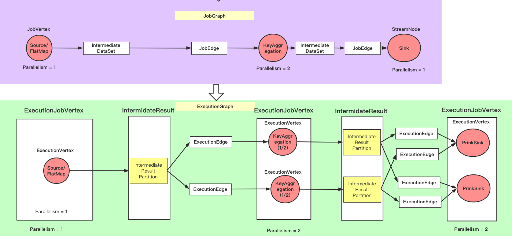
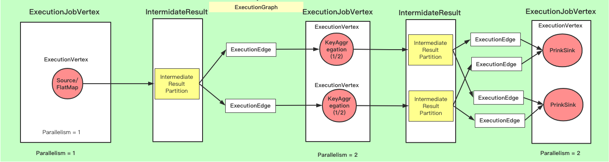

# 将JobGraph转换成ExecutionGraph过程  
## 概述  
JobGraph是StreamGraph经过chain优化后的结果，而ExecutionGraph是按照每个Jobvertex按照其并行度拓展的结果，JobGraph转换
到ExecutionGraph图如下图所示。  
  

## 概念 
**ExecutionJobVertex**  
该对象和JobGraph的JobVertex一一对应，该对象包含一组ExecutionVertex，数量和JobVertex的并行度一致，ExecutionJobVertex将
一个JobVertex封装成ExecutionJobVertex，并依次创建ExecutionVertex、Execution、IntermediateResult和IntermediatePartitionResult、
ExecutionEdge来丰富ExecutionJobvertex，IntermediateResult的数量由JobGraph对应JobVertex的IntermediateDataSet数量决定； 
```java
class ExecutionJobVertex {
    	/** Use the same log for all ExecutionGraph classes. */
    	private static final Logger LOG = ExecutionGraph.LOG;
    
    	public static final int VALUE_NOT_SET = -1;
    
    	private final Object stateMonitor = new Object();
    
    	private final ExecutionGraph graph;
        // ExecutionJobVertex对应的JobVertex
    	private final JobVertex jobVertex;
    
    	/**
    	 * The IDs of all operators contained in this execution job vertex.
    	 *
    	 * <p>The ID's are stored depth-first post-order; for the forking chain below the ID's would be stored as [D, E, B, C, A].
    	 *  A - B - D
    	 *   \    \
    	 *    C    E
    	 * This is the same order that operators are stored in the {@code StreamTask}.
    	 */
    	private final List<OperatorID> operatorIDs;
    
    	/**
    	 * The alternative IDs of all operators contained in this execution job vertex.
    	 *
    	 * <p>The ID's are in the same order as {@link ExecutionJobVertex#operatorIDs}.
    	 */
    	private final List<OperatorID> userDefinedOperatorIds;
        // ExecutionJobVertex对应的ExecutionVertex
    	private final ExecutionVertex[] taskVertices;
        // ExecutionJobVertex 对应的输出中间数据集，这个和JobGraph对应的JobEdge对应
    	private final IntermediateResult[] producedDataSets;
        // ExecutionJobVertex对应的输入中间数据集
    	private final List<IntermediateResult> inputs;
        // ExecutionJobVertex对应的并行度
    	private final int parallelism;
    	private final SlotSharingGroup slotSharingGroup;
    	private final CoLocationGroup coLocationGroup;
        // 输入Split
    	private final InputSplit[] inputSplits;
        
    	private final boolean maxParallelismConfigured;
        // 最大并行度
    	private int maxParallelism;
    	private final ResourceProfile resourceProfile;
    
    	/**
    	 * Either store a serialized task information, which is for all sub tasks the same,
    	 * or the permanent blob key of the offloaded task information BLOB containing
    	 * the serialized task information.
    	 */
    	private Either<SerializedValue<TaskInformation>, PermanentBlobKey> taskInformationOrBlobKey = null;
    
    	private InputSplitAssigner splitAssigner;
}
```  
**ExecutionVertex**    
ExecutionVertex会对作业进行并行化处理，构造可并行执行的实例，每一个并行的实例为ExecutionVertex，ExecutionJobVertex对应的所有ExecutionVertex存放在，
ExecutionJobVertex的taskVertics中，同时ExecutionVertex会生成IntermediatePartitionResult,IntermediatePartitionResult的数量由ExecutionJobVertex的并行度决定，
所以一个ExecutionVertex对应一个IntermediatePartitionResult。 
```java
class ExecutionVertex {
    // ExecutionVertex对应的ExecutionJobVertex
	private final ExecutionJobVertex jobVertex;
    // 每个ExecutionVertex对应的中间结果分区数据集
	private final Map<IntermediateResultPartitionID, IntermediateResultPartition> resultPartitions;
    // 输入边
	private final ExecutionEdge[][] inputEdges;
    // 子任务Id
	private final int subTaskIndex;
	private final ExecutionVertexID executionVertexId;
	private final EvictingBoundedList<ArchivedExecution> priorExecutions;
	private final Time timeout;

	/** The name in the format "myTask (2/7)", cached to avoid frequent string concatenations. */
	private final String taskNameWithSubtask;

	private volatile CoLocationConstraint locationConstraint;

	/** The current or latest execution attempt of this vertex's task. */
	private volatile Execution currentExecution;	// this field must never be null

	private final ArrayList<InputSplit> inputSplits;
}
``` 
**Execution**    
Execution对应的是ExecutionVertex的一次执行，通过 ExecutionAttemptId 来唯一标识，一个 ExecutionVertex 在某些情况下可能会执行多次，比如遇到失败的情况或者该task的数据需要重新计算时；  
```java
class Execution {
	/** The executor which is used to execute futures. */
	private final Executor executor;

	/** The execution vertex whose task this execution executes. */
	private final ExecutionVertex vertex;

	/** The unique ID marking the specific execution instant of the task. */
	private final ExecutionAttemptID attemptId;

	/** Gets the global modification version of the execution graph when this execution was created.
	 * This version is bumped in the ExecutionGraph whenever a global failover happens. It is used
	 * to resolve conflicts between concurrent modification by global and local failover actions. */
	private final long globalModVersion;

	/** The timestamps when state transitions occurred, indexed by {@link ExecutionState#ordinal()}. */
	private final long[] stateTimestamps;

	private final int attemptNumber;

	private final Time rpcTimeout;

	private final Collection<PartitionInfo> partitionInfos;

	/** A future that completes once the Execution reaches a terminal ExecutionState. */
	private final CompletableFuture<ExecutionState> terminalStateFuture;

	private final CompletableFuture<?> releaseFuture;

	private final CompletableFuture<TaskManagerLocation> taskManagerLocationFuture;

	private volatile ExecutionState state = CREATED;

	private volatile LogicalSlot assignedResource;

	private volatile Throwable failureCause;          // once assigned, never changes

	/** Information to restore the task on recovery, such as checkpoint id and task state snapshot. */
	@Nullable
	private volatile JobManagerTaskRestore taskRestore;

	/** This field holds the allocation id once it was assigned successfully. */
	@Nullable
	private volatile AllocationID assignedAllocationID;

	// ------------------------ Accumulators & Metrics ------------------------

	/** Lock for updating the accumulators atomically.
	 * Prevents final accumulators to be overwritten by partial accumulators on a late heartbeat. */
	private final Object accumulatorLock = new Object();

	/* Continuously updated map of user-defined accumulators */
	private volatile Map<String, Accumulator<?, ?>> userAccumulators;

	private volatile IOMetrics ioMetrics;

	private Map<IntermediateResultPartitionID, ResultPartitionDeploymentDescriptor> producedPartitions;
}
```
**IntermediateResult**        
IntermediateResult表示中间结果集，该对象表示的是ExecutionJobVertex的输出，和JobGraph的IntermediateDataSet对应，一个ExecutionJobVertex可以有一个或多个IntermediateResult，一个
IntermediateResult可以有一个或多个IntermediateResultPartition，IntermediateResultPartition的数量由ExecutionJobVertex的并行度决定。  
```java
class IntermediateResult {
	private final IntermediateDataSetID id;
	//中间数据集对应的生产者ExecutionJobVertex
	private final ExecutionJobVertex producer;

	private final IntermediateResultPartition[] partitions;

	/**
	 * Maps intermediate result partition IDs to a partition index. This is
	 * used for ID lookups of intermediate results. I didn't dare to change the
	 * partition connect logic in other places that is tightly coupled to the
	 * partitions being held as an array.
	 */
	private final HashMap<IntermediateResultPartitionID, Integer> partitionLookupHelper = new HashMap<>();
	// 生产者数量
	private final int numParallelProducers;

	private final AtomicInteger numberOfRunningProducers;

	private int partitionsAssigned;

	private int numConsumers;

	private final int connectionIndex;
	// 结果分区类型
	private final ResultPartitionType resultType;
}
```
**IntermediateResultPartition**       
IntermediateResultPartition表示中间结果分区，表示1个ExecutionVertex的输出结果，该对象和ExecutionEdge连接。  
```java
class IntermediateResultPartition {
	// 中间数据集
	private final IntermediateResult totalResult;

	private final ExecutionVertex producer;

	private final int partitionNumber;
	// 分区Id信息
	private final IntermediateResultPartitionID partitionId;
	// 消费者Edge，IntermediateResultPartition连接的是ExecutionVertex和ExecutionEdge
	private List<List<ExecutionEdge>> consumers;
}
```
**ExecutionEdge**    
ExecutionEdge是连接ExecutionResultPartition和ExecutionVertex，当前ExecutionJobVertex会生成和父ExecutionJobVertex的ExecutionEdge关系。ExecutionEdge按照JobGraph的JobEdge
的不同可以分为一对一连接和全连接。 
```java
class ExecutioEdge {
    // ExecutionEdge连接的是IntermediateResultPartition和ExecutionVertex
	private final IntermediateResultPartition source;
    // 输出ExecutionVertex
	private final ExecutionVertex target;
	private final int inputNum;
}
``` 
   
## 源码实现  
### ExecutionGraphBuilder开始buildGraph  
```java
class ExecutionGraphBuilder {
    // 功能：构建ExecutionGraph
	public static ExecutionGraph buildGraph(
		@Nullable ExecutionGraph prior,
		JobGraph jobGraph,
		Configuration jobManagerConfig,
		ScheduledExecutorService futureExecutor,
		Executor ioExecutor,
		SlotProvider slotProvider,
		ClassLoader classLoader,
		CheckpointRecoveryFactory recoveryFactory,
		Time rpcTimeout,
		RestartStrategy restartStrategy,
		MetricGroup metrics,
		BlobWriter blobWriter,
		Time allocationTimeout,
		Logger log,
		ShuffleMaster<?> shuffleMaster,
		JobMasterPartitionTracker partitionTracker,
		FailoverStrategy.Factory failoverStrategyFactory) throws JobExecutionException, JobException {

		checkNotNull(jobGraph, "job graph cannot be null");

		final String jobName = jobGraph.getName();
		final JobID jobId = jobGraph.getJobID();

		final JobInformation jobInformation = new JobInformation(
			jobId,
			jobName,
			jobGraph.getSerializedExecutionConfig(),
			jobGraph.getJobConfiguration(),
			jobGraph.getUserJarBlobKeys(),
			jobGraph.getClasspaths());

		final int maxPriorAttemptsHistoryLength =
				jobManagerConfig.getInteger(JobManagerOptions.MAX_ATTEMPTS_HISTORY_SIZE);
		// 决定什么时候释放 IntermediateResultPartitions 的策略
		final PartitionReleaseStrategy.Factory partitionReleaseStrategyFactory =
			PartitionReleaseStrategyFactoryLoader.loadPartitionReleaseStrategyFactory(jobManagerConfig);

		// 创建ExecutionGraph时没有涉及转换过程，只构造出ExecutionGraph对象
		final ExecutionGraph executionGraph;
		try {
			executionGraph = (prior != null) ? prior :
				new ExecutionGraph(
					jobInformation,
					futureExecutor,
					ioExecutor,
					rpcTimeout,
					restartStrategy,
					maxPriorAttemptsHistoryLength,
					failoverStrategyFactory,
					slotProvider,
					classLoader,
					blobWriter,
					allocationTimeout,
					partitionReleaseStrategyFactory,
					shuffleMaster,
					partitionTracker,
					jobGraph.getScheduleMode());
		} catch (IOException e) {
			throw new JobException("Could not create the ExecutionGraph.", e);
		}

		// set the basic properties
		// 将jobGraph信息转换成json数据
		try {
			executionGraph.setJsonPlan(JsonPlanGenerator.generatePlan(jobGraph));
		}
		catch (Throwable t) {
			log.warn("Cannot create JSON plan for job", t);
			// give the graph an empty plan
			executionGraph.setJsonPlan("{}");
		}

		// initialize the vertices that have a master initialization hook
		// file output formats create directories here, input formats create splits

		final long initMasterStart = System.nanoTime();
		log.info("Running initialization on master for job {} ({}).", jobName, jobId);
		// 判断每一个JobVertex的invokableClassName是否为空，为空则异常
		for (JobVertex vertex : jobGraph.getVertices()) {
			String executableClass = vertex.getInvokableClassName();
			if (executableClass == null || executableClass.isEmpty()) {
				throw new JobSubmissionException(jobId,
						"The vertex " + vertex.getID() + " (" + vertex.getName() + ") has no invokable class.");
			}
			// 对于 InputOutputFormatVertex 类型的对象，会在master节点做一些额外的初始化操作，目前没有遇到使用场景
			try {
				vertex.initializeOnMaster(classLoader);
			}
			catch (Throwable t) {
					throw new JobExecutionException(jobId,
							"Cannot initialize task '" + vertex.getName() + "': " + t.getMessage(), t);
			}
		}
		log.info("Successfully ran initialization on master in {} ms.",
				(System.nanoTime() - initMasterStart) / 1_000_000);
		// 按照依赖链路先后顺序排序jobGraph的JobVertex
		List<JobVertex> sortedTopology = jobGraph.getVerticesSortedTopologicallyFromSources();
		if (log.isDebugEnabled()) {
			log.debug("Adding {} vertices from job graph {} ({}).", sortedTopology.size(), jobName, jobId);
		}
		// 核心逻辑，生成ExecutionGraph
		executionGraph.attachJobGraph(sortedTopology);

		if (log.isDebugEnabled()) {
			log.debug("Successfully created execution graph from job graph {} ({}).", jobName, jobId);
		}

		// 配置checkpoint
		JobCheckpointingSettings snapshotSettings = jobGraph.getCheckpointingSettings();
		if (snapshotSettings != null) {
			List<ExecutionJobVertex> triggerVertices =
					idToVertex(snapshotSettings.getVerticesToTrigger(), executionGraph);

			List<ExecutionJobVertex> ackVertices =
					idToVertex(snapshotSettings.getVerticesToAcknowledge(), executionGraph);

			List<ExecutionJobVertex> confirmVertices =
					idToVertex(snapshotSettings.getVerticesToConfirm(), executionGraph);

			CompletedCheckpointStore completedCheckpoints;
			CheckpointIDCounter checkpointIdCounter;
			try {
				int maxNumberOfCheckpointsToRetain = jobManagerConfig.getInteger(
						CheckpointingOptions.MAX_RETAINED_CHECKPOINTS);

				if (maxNumberOfCheckpointsToRetain <= 0) {
					// warning and use 1 as the default value if the setting in
					// state.checkpoints.max-retained-checkpoints is not greater than 0.
					log.warn("The setting for '{} : {}' is invalid. Using default value of {}",
							CheckpointingOptions.MAX_RETAINED_CHECKPOINTS.key(),
							maxNumberOfCheckpointsToRetain,
							CheckpointingOptions.MAX_RETAINED_CHECKPOINTS.defaultValue());

					maxNumberOfCheckpointsToRetain = CheckpointingOptions.MAX_RETAINED_CHECKPOINTS.defaultValue();
				}

				completedCheckpoints = recoveryFactory.createCheckpointStore(jobId, maxNumberOfCheckpointsToRetain, classLoader);
				checkpointIdCounter = recoveryFactory.createCheckpointIDCounter(jobId);
			}
			catch (Exception e) {
				throw new JobExecutionException(jobId, "Failed to initialize high-availability checkpoint handler", e);
			}

			// Maximum number of remembered checkpoints
			int historySize = jobManagerConfig.getInteger(WebOptions.CHECKPOINTS_HISTORY_SIZE);

			CheckpointStatsTracker checkpointStatsTracker = new CheckpointStatsTracker(
					historySize,
					ackVertices,
					snapshotSettings.getCheckpointCoordinatorConfiguration(),
					metrics);

			// load the state backend from the application settings
			// 配置StateBackend
			final StateBackend applicationConfiguredBackend;
			final SerializedValue<StateBackend> serializedAppConfigured = snapshotSettings.getDefaultStateBackend();

			if (serializedAppConfigured == null) {
				applicationConfiguredBackend = null;
			}
			else {
				try {
					applicationConfiguredBackend = serializedAppConfigured.deserializeValue(classLoader);
				} catch (IOException | ClassNotFoundException e) {
					throw new JobExecutionException(jobId,
							"Could not deserialize application-defined state backend.", e);
				}
			}

			final StateBackend rootBackend;
			try {
				rootBackend = StateBackendLoader.fromApplicationOrConfigOrDefault(
						applicationConfiguredBackend, jobManagerConfig, classLoader, log);
			}
			catch (IllegalConfigurationException | IOException | DynamicCodeLoadingException e) {
				throw new JobExecutionException(jobId, "Could not instantiate configured state backend", e);
			}

			// instantiate the user-defined checkpoint hooks

			final SerializedValue<MasterTriggerRestoreHook.Factory[]> serializedHooks = snapshotSettings.getMasterHooks();
			final List<MasterTriggerRestoreHook<?>> hooks;

			if (serializedHooks == null) {
				hooks = Collections.emptyList();
			}
			else {
				final MasterTriggerRestoreHook.Factory[] hookFactories;
				try {
					hookFactories = serializedHooks.deserializeValue(classLoader);
				}
				catch (IOException | ClassNotFoundException e) {
					throw new JobExecutionException(jobId, "Could not instantiate user-defined checkpoint hooks", e);
				}

				final Thread thread = Thread.currentThread();
				final ClassLoader originalClassLoader = thread.getContextClassLoader();
				thread.setContextClassLoader(classLoader);

				try {
					hooks = new ArrayList<>(hookFactories.length);
					for (MasterTriggerRestoreHook.Factory factory : hookFactories) {
						hooks.add(MasterHooks.wrapHook(factory.create(), classLoader));
					}
				}
				finally {
					thread.setContextClassLoader(originalClassLoader);
				}
			}

			final CheckpointCoordinatorConfiguration chkConfig = snapshotSettings.getCheckpointCoordinatorConfiguration();

			executionGraph.enableCheckpointing(
				chkConfig,
				triggerVertices,
				ackVertices,
				confirmVertices,
				hooks,
				checkpointIdCounter,
				completedCheckpoints,
				rootBackend,
				checkpointStatsTracker);
		}

		// create all the metrics for the Execution Graph

		metrics.gauge(RestartTimeGauge.METRIC_NAME, new RestartTimeGauge(executionGraph));
		metrics.gauge(DownTimeGauge.METRIC_NAME, new DownTimeGauge(executionGraph));
		metrics.gauge(UpTimeGauge.METRIC_NAME, new UpTimeGauge(executionGraph));

		executionGraph.getFailoverStrategy().registerMetrics(metrics);

		return executionGraph;
	}    
}
```   
buildGraph函数开始初始化ExecutionGraph对象，对JobGraph的JobVertex进行了排序生成sortedTopology对象，然后进入核心方法attachJobGraph来生成ExecutionGraph，
接着处理了checkpoint配置信息，StateBackend信息等配置；  

### ExecutionGraph生成方法 attachJobGraph  
```java
class ExecutionGraph {
	/**
	 * 功能：核心逻辑，生成ExecutionGraph
	 *
	 * @param topologiallySorted
	 * @throws JobException
	 */
	public void attachJobGraph(List<JobVertex> topologiallySorted) throws JobException {

		assertRunningInJobMasterMainThread();

		LOG.debug("Attaching {} topologically sorted vertices to existing job graph with {} " +
				"vertices and {} intermediate results.",
			topologiallySorted.size(),
			tasks.size(),
			intermediateResults.size());
		// 初始化newExecJobVertices对象来保存ExecutionJobVertex信息
		final ArrayList<ExecutionJobVertex> newExecJobVertices = new ArrayList<>(topologiallySorted.size());
		final long createTimestamp = System.currentTimeMillis();
		//为每一个JobVertex生成对应的ExecutionJobVertex和进行依赖关系串联
		for (JobVertex jobVertex : topologiallySorted) {
			// 如果jobVertex是输入Vertex（即：该Vertex的inputs为空，顶点Vertex）
			if (jobVertex.isInputVertex() && !jobVertex.isStoppable()) {
				this.isStoppable = false;
			}
			//生成ExecutionJobVertex对象
			ExecutionJobVertex ejv = new ExecutionJobVertex(
					this,
					jobVertex,
					1,
					maxPriorAttemptsHistoryLength,
					rpcTimeout,
					globalModVersion,
					createTimestamp);
			//构建当前ExecutionJobVertex和父ExecutionJobVertex的串联关系，这里就是生成ExecutionEdge
			ejv.connectToPredecessors(this.intermediateResults);
			// 保存ExecutionJobVertex
			ExecutionJobVertex previousTask = this.tasks.putIfAbsent(jobVertex.getID(), ejv);
			if (previousTask != null) {
				throw new JobException(String.format("Encountered two job vertices with ID %s : previous=[%s] / new=[%s]",
					jobVertex.getID(), ejv, previousTask));
			}
			//当前ExecutionJobVertex的输出个数决定
			for (IntermediateResult res : ejv.getProducedDataSets()) {
				IntermediateResult previousDataSet = this.intermediateResults.putIfAbsent(res.getId(), res);
				if (previousDataSet != null) {
					throw new JobException(String.format("Encountered two intermediate data set with ID %s : previous=[%s] / new=[%s]",
						res.getId(), res, previousDataSet));
				}
			}
			// 保存ExecutionJobVertex
			this.verticesInCreationOrder.add(ejv);
			this.numVerticesTotal += ejv.getParallelism();
			newExecJobVertices.add(ejv);
		}
		// the topology assigning should happen before notifying new vertices to failoverStrategy
        // todo: 这里后面查一下功能是怎么样的
		executionTopology = new DefaultExecutionTopology(this);
		failoverStrategy.notifyNewVertices(newExecJobVertices);
		partitionReleaseStrategy = partitionReleaseStrategyFactory.createInstance(getSchedulingTopology());
	}
}
```
attachJobGraph函数中最重要的两步是构建ExecutionJobVertex对象和构建父子ExecutionJobVertex的联系，在构建ExecutionJobVertex对象时会生成ExecutionVertex、IntermediateResult、IntermediateResultPartition对象，
在ejv.connectToPredecessors函数中，会生成当前ExecutionJobVertex和父ExecutionJobVertex的ExecutionEdge关系； 

### ExecutionJobVertex new对象  
```java
class ExecutionJobVertex {
	public ExecutionJobVertex(
			ExecutionGraph graph,
			JobVertex jobVertex,
			int defaultParallelism,
			int maxPriorAttemptsHistoryLength,
			Time timeout,
			long initialGlobalModVersion,
			long createTimestamp) throws JobException {

		if (graph == null || jobVertex == null) {
			throw new NullPointerException();
		}

		this.graph = graph;
		this.jobVertex = jobVertex;
		// 获取并行度
		int vertexParallelism = jobVertex.getParallelism();
		int numTaskVertices = vertexParallelism > 0 ? vertexParallelism : defaultParallelism;
		// 获取最大并行度
		final int configuredMaxParallelism = jobVertex.getMaxParallelism();
		this.maxParallelismConfigured = (VALUE_NOT_SET != configuredMaxParallelism);
		// if no max parallelism was configured by the user, we calculate and set a default
		setMaxParallelismInternal(maxParallelismConfigured ?
				configuredMaxParallelism : KeyGroupRangeAssignment.computeDefaultMaxParallelism(numTaskVertices));

		// verify that our parallelism is not higher than the maximum parallelism
		if (numTaskVertices > maxParallelism) {
			throw new JobException(
				String.format("Vertex %s's parallelism (%s) is higher than the max parallelism (%s). Please lower the parallelism or increase the max parallelism.",
					jobVertex.getName(),
					numTaskVertices,
					maxParallelism));
		}
		// ExecutionVertex数量由并行度决定
		this.parallelism = numTaskVertices;
		this.resourceProfile = ResourceProfile.fromResourceSpec(jobVertex.getMinResources(), MemorySize.ZERO);
		// ExecutionVertex生成 ExecutionJobVertex中的taskVertices就是指的ExecutionVertex集合
		this.taskVertices = new ExecutionVertex[numTaskVertices];
		this.operatorIDs = Collections.unmodifiableList(jobVertex.getOperatorIDs());
		this.userDefinedOperatorIds = Collections.unmodifiableList(jobVertex.getUserDefinedOperatorIDs());
		// jobVertex的输入
		this.inputs = new ArrayList<>(jobVertex.getInputs().size());

		// take the sharing group
		this.slotSharingGroup = jobVertex.getSlotSharingGroup();
		this.coLocationGroup = jobVertex.getCoLocationGroup();

		// setup the coLocation group
		if (coLocationGroup != null && slotSharingGroup == null) {
			throw new JobException("Vertex uses a co-location constraint without using slot sharing");
		}

		// create the intermediate results
		//IntermediateResult这个是根据jobVertex的输出边决定的
		this.producedDataSets = new IntermediateResult[jobVertex.getNumberOfProducedIntermediateDataSets()];
		// 生成每一个IntermediateResult数据集
		for (int i = 0; i < jobVertex.getProducedDataSets().size(); i++) {
			final IntermediateDataSet result = jobVertex.getProducedDataSets().get(i);
			this.producedDataSets[i] = new IntermediateResult(
					result.getId(),
					this,
					numTaskVertices,
					result.getResultType());
		}

		// 按照ExecutionJobVertex的并行度生成对应的ExecutionVertex
		for (int i = 0; i < numTaskVertices; i++) {
			// 生成ExecutionVertex对象，在这里会生成IntermediateResultPartition对象
			ExecutionVertex vertex = new ExecutionVertex(
					this,
					i,
					producedDataSets,
					timeout,
					initialGlobalModVersion,
					createTimestamp,
					maxPriorAttemptsHistoryLength);
			// taskVertices存放着 ExecutionVertex
			this.taskVertices[i] = vertex;
		}
		// sanity check for the double referencing between intermediate result partitions and execution vertices
		for (IntermediateResult ir : this.producedDataSets) {
			if (ir.getNumberOfAssignedPartitions() != parallelism) {
				throw new RuntimeException("The intermediate result's partitions were not correctly assigned.");
			}
		}
		// set up the input splits, if the vertex has any
		try {
			@SuppressWarnings("unchecked")
			InputSplitSource<InputSplit> splitSource = (InputSplitSource<InputSplit>) jobVertex.getInputSplitSource();

			if (splitSource != null) {
				Thread currentThread = Thread.currentThread();
				ClassLoader oldContextClassLoader = currentThread.getContextClassLoader();
				currentThread.setContextClassLoader(graph.getUserClassLoader());
				try {
					inputSplits = splitSource.createInputSplits(numTaskVertices);

					if (inputSplits != null) {
						splitAssigner = splitSource.getInputSplitAssigner(inputSplits);
					}
				} finally {
					currentThread.setContextClassLoader(oldContextClassLoader);
				}
			}
			else {
				inputSplits = null;
			}
		}
		catch (Throwable t) {
			throw new JobException("Creating the input splits caused an error: " + t.getMessage(), t);
		}
	}
}
```
这块主要是生成了IntermediateResult, 且在 new ExecutionVertex()中生成了ExecutionVertex对象和IntermediateResultPartition对象。ExcutionVertex对象是由ExecutionJobVertex的并行度决定，
IntermediateResult对象是由ExecutionJobVertex的输出边决定。  

### ExecutionVertex new对象   
```java
class ExecutionVertex {
	public ExecutionVertex(
			ExecutionJobVertex jobVertex,
			int subTaskIndex,
			IntermediateResult[] producedDataSets,
			Time timeout,
			long initialGlobalModVersion,
			long createTimestamp,
			int maxPriorExecutionHistoryLength) {

		this.jobVertex = jobVertex;
		this.subTaskIndex = subTaskIndex;
		this.executionVertexId = new ExecutionVertexID(jobVertex.getJobVertexId(), subTaskIndex);
		this.taskNameWithSubtask = String.format("%s (%d/%d)",
				jobVertex.getJobVertex().getName(), subTaskIndex + 1, jobVertex.getParallelism());

		this.resultPartitions = new LinkedHashMap<>(producedDataSets.length, 1);
		// 为每一个ExecutionVertex对象生成对应的IntermediateResultPartition，所以在一个JobVertex只有一个JobEdge的情况下
		// IntermediateResultPartition的数量由ExecutionJobVertex的并行度决定
		for (IntermediateResult result : producedDataSets) {
			IntermediateResultPartition irp = new IntermediateResultPartition(result, this, subTaskIndex);
			result.setPartition(subTaskIndex, irp);

			resultPartitions.put(irp.getPartitionId(), irp);
		}
		// 创建inputEdges对象
		this.inputEdges = new ExecutionEdge[jobVertex.getJobVertex().getInputs().size()][];

		this.priorExecutions = new EvictingBoundedList<>(maxPriorExecutionHistoryLength);
		// 获取执行器
		this.currentExecution = new Execution(
			getExecutionGraph().getFutureExecutor(),
			this,
			0,
			initialGlobalModVersion,
			createTimestamp,
			timeout);

		// create a co-location scheduling hint, if necessary
		CoLocationGroup clg = jobVertex.getCoLocationGroup();
		if (clg != null) {
			this.locationConstraint = clg.getLocationConstraint(subTaskIndex);
		}
		else {
			this.locationConstraint = null;
		}

		getExecutionGraph().registerExecution(currentExecution);

		this.timeout = timeout;
		this.inputSplits = new ArrayList<>();
	}
}  
```   
ExecutionVertex实例化时先会生成IntermediateResultPartition，通过判断ExecutionJobVertex的输出数量来决定该ExecutionVertex的IntermediateResultPartition的个数，
同时会按照ExecutionVertex对应的JobVertex的输入数量决定inputEdge[][]的数量，inputEdges是二维数组，用来存放ExecutionVertex的输入边（ExecutionEdge），同时生成执行器。   
此时已生成ExecutionJobVertex对应的ExecutionVertex数组和IntermediateResultPartition 和 ExecutionEdge容器；   

```java
class ExecutionJobVertex { 
	/**
	 * 功能：构建边的依赖关系
	 *
	 * @param intermediateDataSets
	 * @throws JobException
	 */
	public void connectToPredecessors(Map<IntermediateDataSetID, IntermediateResult> intermediateDataSets) throws JobException {
		//
		List<JobEdge> inputs = jobVertex.getInputs();

		if (LOG.isDebugEnabled()) {
			LOG.debug(String.format("Connecting ExecutionJobVertex %s (%s) to %d predecessors.", jobVertex.getID(), jobVertex.getName(), inputs.size()));
		}

		for (int num = 0; num < inputs.size(); num++) {
			JobEdge edge = inputs.get(num);

			if (LOG.isDebugEnabled()) {
				if (edge.getSource() == null) {
					LOG.debug(String.format("Connecting input %d of vertex %s (%s) to intermediate result referenced via ID %s.",
							num, jobVertex.getID(), jobVertex.getName(), edge.getSourceId()));
				} else {
					LOG.debug(String.format("Connecting input %d of vertex %s (%s) to intermediate result referenced via predecessor %s (%s).",
							num, jobVertex.getID(), jobVertex.getName(), edge.getSource().getProducer().getID(), edge.getSource().getProducer().getName()));
				}
			}

			// fetch the intermediate result via ID. if it does not exist, then it either has not been created, or the order
			// in which this method is called for the job vertices is not a topological order
			// 获取输入的IntermediateResult
			IntermediateResult ires = intermediateDataSets.get(edge.getSourceId());
			if (ires == null) {
				throw new JobException("Cannot connect this job graph to the previous graph. No previous intermediate result found for ID "
						+ edge.getSourceId());
			}

			this.inputs.add(ires);

			int consumerIndex = ires.registerConsumer();
			// 有两个ExecutionVertex，生成了两个IntermidateResultPartition 和 ExecutionEdge，所有是由下游的ExecutionJobVertex的ExecutionVertex来决定有几个IntermidateResultPartition 和 ExecutionEdge
			// 按照ExecutionJobVertex的并行度对每一个ExecutionVertex进行连接
			// 按照当前ExecutionJobVertex的并行度，去尝试为每一个ExecutionVertex创建连接
			for (int i = 0; i < parallelism; i++) {
				// 遍历每一个ExecutionVertex
				ExecutionVertex ev = taskVertices[i];
				ev.connectSource(num, ires, edge, consumerIndex);
			}
		}
	}
}
``` 
connectToPredecessors方法是为了生成当前ExecutionJobVertex和父ExecutionJobVertex的ExecutionEdge关系，JobVertex对应的每个输入JobEdge都会产生一个IntermediateResult对象，然后通过ExecutionJobVertex的并行度去为每一个
ExecutionVertex生成和上游IntermediatePartitionResult构建ExecutionEdge关系；  

```java
class ExecutionVertex{ 
	// 用ExecutionEdge 连接IntermediatePartitonResult和ExecutionVertex
	public void connectSource(int inputNumber, IntermediateResult source, JobEdge edge, int consumerNumber) {
		final DistributionPattern pattern = edge.getDistributionPattern();
		// 获取输入的IntermediateResultPartitions，并和ExecutionVertex串联
		final IntermediateResultPartition[] sourcePartitions = source.getPartitions();

		ExecutionEdge[] edges;

		switch (pattern) {
			//一对一连接
			case POINTWISE:
				edges = connectPointwise(sourcePartitions, inputNumber);
				break;
			//全联接
			case ALL_TO_ALL:
				edges = connectAllToAll(sourcePartitions, inputNumber);
				break;

			default:
				throw new RuntimeException("Unrecognized distribution pattern.");

		}

		inputEdges[inputNumber] = edges;

		// add the consumers to the source
		// for now (until the receiver initiated handshake is in place), we need to register the
		// edges as the execution graph
		for (ExecutionEdge ee : edges) {
			ee.getSource().addConsumer(ee, consumerNumber);
		}
	}
}
```
具体生成逻辑是（这里介绍全联接情况）：如果ExecutionJobVertexA的并行度为2，ExecutionJobVertexB的并行度为4，那么首先遍历ExecutionJobVertexB的每一个ExecutionVertexB，然后ExecutionJobVertexA有两个IntermediateResultPartition，那么会为每一个ExecutionVertexB
生成两个ExecutionEdge，来连接ExecutionJobVertexA的每一个IntermediateResultPartition和ExecutionVertexB。所以总共有8个ExecutionEdge。  




