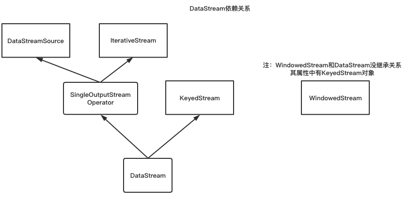

# 用户定义的算子转换成Operators    
## DataStream对象  
DataStream是基础流对象，类关系如下所示  


## 将用户代码转换成Operators  
参考代码
```java
public class TransformDemo {
    public void transformDemo() {
		//构建ExecutionEnvironment
		StreamExecutionEnvironment env = StreamExecutionEnvironment.getExecutionEnvironment();
		//读取输入数据
		//生成textStream，没有放在env的transforms中
		DataStream<String> textStream = env.fromElements(WordCountData.WORDS);

		//数据转换
		//生成flatMapStream，并指定了父Task为textStream，并把flatMapStream放到transforms中
		SingleOutputStreamOperator<Tuple2<String, Integer>> flatMapStream = textStream
				.flatMap(new LineSplit())
				.setParallelism(1);
		//生成keyedStream并定义了KeySelector
		KeyedStream<Tuple2<String, Integer>, Tuple> keyedStream = flatMapStream.keyBy(0);
		//生成SumAggregator，并将SumAggregator放到env的transforms中
		DataStream<Tuple2<String, Integer>> sum = keyedStream
				.sum(1)
				.setParallelism(2);
		//结果打印输出
		//将PrintSinkFunction加入到transforms中
		sum.print();
		//执行代码
		env.execute(SocketTextStreamWordCount.class.getSimpleName());
    }
}
```
在编写Flink代码时，首先需要构造算子操作链关系，如上代码 sourceIn->flatMap->keyBy->sum->printOut，所有的操作都会被转换为transformation，
transformation主要实现类如图1，构造操作链过程为：
1.构造顶点DataStreamSource，返回DataStream对象  
```java
class SourceConstructor{
	public <OUT> DataStreamSource<OUT> addSource(SourceFunction<OUT> function, String sourceName, TypeInformation<OUT> typeInfo) {

		if (typeInfo == null && function instanceof ResultTypeQueryable) {
			typeInfo = ((ResultTypeQueryable<OUT>) function).getProducedType();
		}
		// 获取输入的数据类型
		if (typeInfo == null) {
			try {
                //如果输入类型不存在，则按照SourceFunction去提取数据类型
				typeInfo = TypeExtractor.createTypeInfo(
						SourceFunction.class,
						function.getClass(), 0, null, null);
			} catch (final InvalidTypesException e) {
				typeInfo = (TypeInformation<OUT>) new MissingTypeInfo(sourceName, e);
			}
		}
		// 判断函数是否可以并行计算
		boolean isParallel = function instanceof ParallelSourceFunction;
        //判断这个function是否可以序列化
		clean(function);
		// 构建sourceOperator，
		final StreamSource<OUT, ?> sourceOperator = new StreamSource<>(function);
        // 生成顶点DataStream，此时没有对env中加入transformation
		return new DataStreamSource<>(this, typeInfo, sourceOperator, isParallel, sourceName);
	}
}
```  

2.构造flatMap操作，生成OneInputTransformation，并将其放入SingleOutputStreamOperator对象中，并返回SingleOutputStreamOperator对象，同时将其加入env.transformations中，
SingleOutputStreamOperator对象是DataStream的子类。
```java
class FlatMapConstructor {
    // 通过StreamFlatMap将用户定义的flatMapFunction包装起来，在StreamFlatMap中有processElement方法
    // Task会反序列化userFunction并调用userFunction.processElement 从而调用用户定义的Function
    //clean(flatMapper)调用确保flatMapper可被序列化，序列化判断方法是InstantiationUtil.serializeObject(obj)
    public <R> SingleOutputStreamOperator<R> flatMap(FlatMapFunction<T, R> flatMapper, TypeInformation<R> outputType) {
        return transform("Flat Map", outputType, new StreamFlatMap<>(clean(flatMapper)));
    }

    // 
	protected <R> SingleOutputStreamOperator<R> doTransform(
			String operatorName,
			TypeInformation<R> outTypeInfo,
			StreamOperatorFactory<R> operatorFactory) {
		// 把当前的transformation的输出值作为 下一个transformation的输入值。
		transformation.getOutputType();
        // 
		OneInputTransformation<T, R> resultTransform = new OneInputTransformation<>(
		        // 传入上一个transformation对象，构造父子依赖链路
				this.transformation,
				operatorName,
				// 用户定义的操作方法
				operatorFactory,
				outTypeInfo,
				environment.getParallelism());

		//构造SingleOutputStreamOperator并将其加到Operator中，然后返回SingleOutputStreamOperator对象
		@SuppressWarnings({"unchecked", "rawtypes"})
		SingleOutputStreamOperator<R> returnStream = new SingleOutputStreamOperator(environment, resultTransform);
		//将transform加入到env.tranforms中，env.transforms中有所有的transformer节点，sourceTransform单独放在env中，作为顶点；  
		getExecutionEnvironment().addOperator(resultTransform);
		return returnStream;
	}
}  
```
  
3.构造keyBy操作，生成KeyStream，keyStream是DataStream的实现类，实际上没有上上面构造出新的DataStream，只是将上一个DataStream进行了包装，并在KeyStream中增加了keySelector和keyType属性  
```java
class KeyStreamConstructor {
    	KeyedStream(
            // 上一个持有的DataStream，没有生成新的transformation
    		DataStream<T> stream,
            // 分区转换
    		PartitionTransformation<T> partitionTransformation,
    		KeySelector<T, KEY> keySelector,
    		TypeInformation<KEY> keyType) {
    
    		super(stream.getExecutionEnvironment(), partitionTransformation);
    		this.keySelector = clean(keySelector);
    		this.keyType = validateKeyType(keyType);
    	}
}
```  

4.构造sum操作，生成StreamGroupedReduce，并将其放入SingleOutputStreamOperator中，并把transformation放入env.transformations中，其和flatMap逻辑除了用户定义的操作不一致，其他一致
```java
class AggrConstructor {
	protected <R> SingleOutputStreamOperator<R> doTransform(
			String operatorName,
			TypeInformation<R> outTypeInfo,
			StreamOperatorFactory<R> operatorFactory) {

		// 把当前的transformation的输出值作为 下一个transformation的输入值。
		transformation.getOutputType();
        // operatorFactory是StreamGroupedReduce，里面有定义具体的processElement方法
		OneInputTransformation<T, R> resultTransform = new OneInputTransformation<>(
				this.transformation,
				operatorName,
				operatorFactory,
				outTypeInfo,
				environment.getParallelism());

		//构造SingleOutputStreamOperator并将其加到Operator中，然后返回SingleOutputStreamOperator对象
		@SuppressWarnings({"unchecked", "rawtypes"})
		SingleOutputStreamOperator<R> returnStream = new SingleOutputStreamOperator(environment, resultTransform);
		//将transform加入到env.tranforms中
		getExecutionEnvironment().addOperator(resultTransform);
		return returnStream;
	}
}
```  

5.构造PrintSink操作（Sink操作重写了invoke方法），生成SinkTransformation，并将其放入StreamSink中，StreamSink有processElement方法(processElement方法调用了invoke方法)，并把StreamSink加入到
DataStreamSink的transform属性中，并返回DataStreamSink，且把transformation加到env.transformations中  
```java
class PrintSink {
    public DataStreamSink<T> print() {
        // 构造PrintSinkFunction
        PrintSinkFunction<T> printFunction = new PrintSinkFunction<>();
        // 构造Sink调用链
        return addSink(printFunction).name("Print to Std. Out");
    }
    // 将sink加入到sinkFunction中
   	public DataStreamSink<T> addSink(SinkFunction<T> sinkFunction) {
   		//获取父节点的输出作为当前节点的输入
   		transformation.getOutputType();
   
   		// configure the type if needed
   		if (sinkFunction instanceof InputTypeConfigurable) {
   			((InputTypeConfigurable) sinkFunction).setInputType(getType(), getExecutionConfig());
   		}
   		// 构造StreamSink，StreamSink中定义了processElement方法，在Task执行时会调用该方法
   		// processElement中定义了userFunction.invoke方法，invoke是SinkFunction重写的方法
   		StreamSink<T> sinkOperator = new StreamSink<>(clean(sinkFunction));
   		//构造DataStreamSink对象，并将StreamSink对象传入
   		DataStreamSink<T> sink = new DataStreamSink<>(this, sinkOperator);
   
   		getExecutionEnvironment().addOperator(sink.getTransformation());
   		return sink;
   	}
}
```  

**总结**：在operator依赖链构造时，顶点和虚拟节点不会放入env.transformations中，其他操作会转换为Transformation或Sink，并实现useFunction.processElement方法，来调用用户定义逻辑;  


