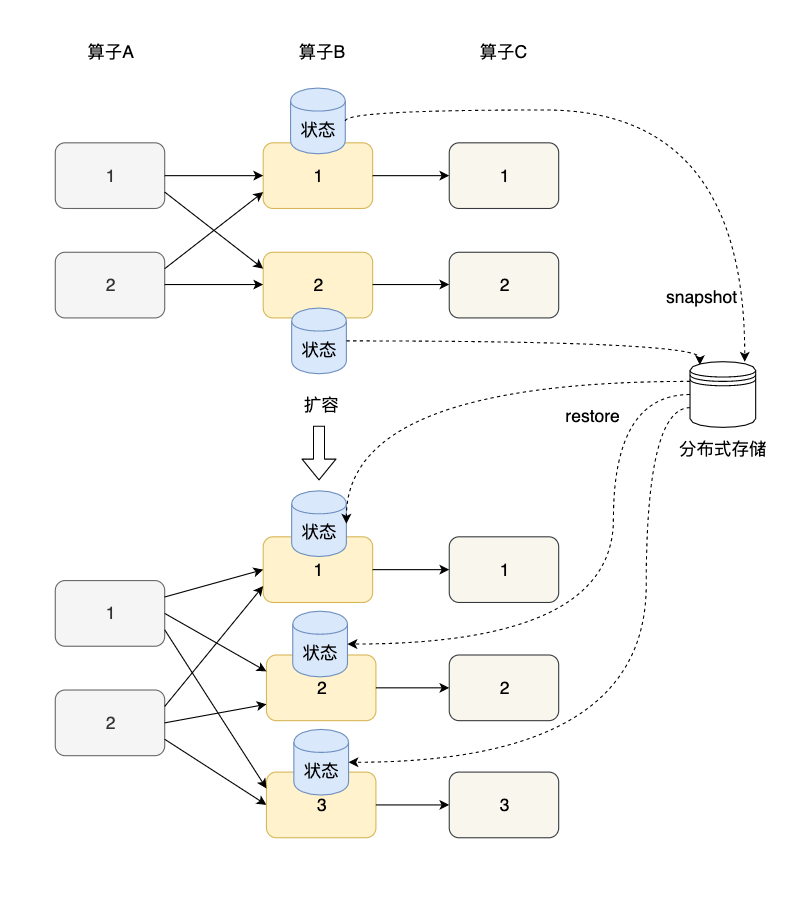
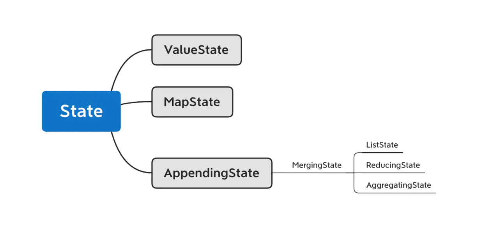

# Flink状态管理    
## Flink状态存储类型  
1. MemoryStateBackend 内存状态存储；  
   MemoryStateBackend 将工作状态数据保存在 taskmanager 的 java 内存中。key/value 状态和 window 算子使用哈希表存储数值和触发器。进行快照时（checkpointing），生成的快照数据将和 checkpoint ACK 消息一起发送给
   jobmanager，jobmanager 将收到的所有快照保存在 java 内存中，在SavePoint时将JobManager的状态存储到HDFS上；    
2. FsStateBackend 文件系统状态存储；     
   FsStateBackend 将工作状态数据保存在 taskmanager 的 java 内存中。进行快照时，再将快照数据写入上面配置的路径，然后将写入的文件路径告知 jobmanager。jobmanager 中保存所有状态的元数据信息(在 HA 模式下，元数据会写入 checkpoint 目录)。
   FsStateBackend 默认使用异步方式进行快照，防止阻塞主线程的 pipline 处理。可以通过 FsStateBackend 构造函数取消；     
3. RocksDBStateBackend RocksDB状态存储；    
   RocksDB 是一种可嵌入的持久型的 key-value 存储引擎，提供 ACID 支持。由 Facebook 基于 levelDB 开发，使用 LSM 存储引擎，是内存和磁盘混合存储。
   RocksDBStateBackend 将工作状态保存在 taskmanager 的 RocksDB 数据库中；checkpoint 时，RocksDB 中的所有数据会被传输到配置的文件目录，少量元数据信息保存在 jobmanager 内存中( HA 模式下，会保存在 checkpoint 目录)。
   
## Flink状态类型  
**Managed State**和**Raw State**，Flink有两种基本类型的状态：托管状态（Managed State）和原生状态（Raw State）。Managed State是由Flink管理的，Flink帮忙存储、恢复和优化，
Raw State是开发者自己管理的，需要自己序列化。  
两者的具体区别有：  
- 从状态管理的方式上来说，Managed State由Flink Runtime托管，状态是自动存储、自动恢复的，Flink在存储管理和持久化上做了一些优化。当我们横向伸缩，或者说我们修改Flink应用的并行度时，
状态也能自动重新分布到多个并行实例上。Raw State是用户自定义的状态。
- 从状态的数据结构上来说，Managed State支持了一系列常见的数据结构，如ValueState、ListState、MapState等。Raw State只支持字节，任何上层数据结构需要序列化为字节数组。使用时，
需要用户自己序列化，以非常底层的字节数组形式存储，Flink并不知道存储的是什么样的数据结构。
- 从具体使用场景来说，绝大多数的算子都可以通过继承Rich函数类或其他提供好的接口类，在里面使用Managed State。Raw State是在已有算子和Managed State不够用时，用户自定义算子时使用;  

对Managed State有两种类型：Keyed State和Operator State；
- Keyed State是KeyedStream上的状态。假如输入流按照id为Key进行了keyBy分组，形成一个KeyedStream，数据流中所有id为1的数据共享一个状态，
可以访问和更新这个状态，以此类推，每个Key对应一个自己的状态。下图展示了Keyed State，因为一个算子子任务可以处理一到多个Key，算子子任务1处理了两种Key，两种Key分别对应自己的状态；  
- Operator State可以用在所有算子上，每个算子子任务或者说每个算子实例共享一个状态，流入这个算子子任务的数据可以访问和更新这个状态。下图展示了Operator State，算子子任务1上的所有
数据可以共享第一个Operator State，以此类推，每个算子子任务上的数据共享自己的状态；   

无论是Keyed State还是Operator State，Flink的状态都是基于本地的，即每个算子子任务维护着这个算子子任务对应的状态存储，算子子任务之间的状态不能相互访问。在之前各算子的介绍中曾提到，
为了自定义Flink的算子，我们可以重写Rich Function接口类，比如RichFlatMapFunction。使用Keyed State时，我们也可以通过重写Rich Function接口类，在里面创建和访问状态。对于Operator State，
我们还需进一步实现CheckpointedFunction接口；  

## 横向扩展  
状态的横向扩展问题主要是指修改Flink应用的并行度，确切的说，每个算子的并行实例数或算子子任务数发生了变化，应用需要关停或启动一些算子子任务，某份在原来某个算子子任务上的状态数据需要平滑更新到新的算子子任务上。
其实，Flink的Checkpoint就是一个非常好的在各算子间迁移状态数据的机制。算子的本地状态将数据生成快照（snapshot），保存到分布式存储（如HDFS）上。横向伸缩后，算子子任务个数变化，子任务重启，相应的状态从分布式存储上重建（rebuild）。    
  
对于Keyed State和Operator State这两种状态，他们的横向伸缩机制不太相同。由于每个Keyed State总是与某个Key相对应，当横向伸缩时，Key总会被自动分配到某个算子子任务上，因此Keyed State会自动在多个并行子任务之间迁移。
对于一个非KeyedStream，流入算子子任务的数据可能会随着并行度的改变而改变。如上图所示，假如一个应用的并行度原来为2，那么数据会被分成两份并行地流入两个算子子任务，每个算子子任务有一份自己的状态，当并行度改为3时，数据流被拆成3支，
或者并行度改为1，数据流合并为1支，此时状态的存储也相应发生了变化。对于横向伸缩问题，Operator State有两种状态分配方式：一种是均匀分配，另一种是将所有状态合并，再分发给每个实例上。  
疑问：key状态哪些应用场景是（只考虑托管情况）、operator状态哪些应用场景是  

## key状态使用  
对于Keyed State，Flink提供了几种现成的数据结构供我们使用，包括ValueState、ListState等，他们的继承关系如下图所示。首先，State主要有三种实现，分别为ValueState、MapState和AppendingState，
AppendingState又可以细分为ListState、ReducingState和AggregatingState。  
  
这几个状态的具体区别在于：  
- ValueState是单一变量的状态，T是某种具体的数据类型，比如Double、String，或我们自己定义的复杂数据结构。我们可以使用value()方法获取状态，使用update(value: T)更新状态  
- MapState存储一个Key-Value map，其功能与Java的Map几乎相同。get(key: K)可以获取某个key下的value，put(key: K, value: V)可以对某个key设置value，contains(key: K)判断某个key是否存在，
remove(key: K)删除某个key以及对应的value，entries(): java.lang.Iterable<java.util.Map.Entry<K, V>>返回MapState中所有的元素，iterator(): java.util.Iterator<java.util.Map.Entry<K, V>>返回一个迭代器。需要注意的是，
MapState中的key和Keyed State的key不是同一个key。  
- ListState<T>存储了一个由T类型数据组成的列表。我们可以使用add(value: T)或addAll(values: java.util.List<T>)向状态中添加元素，使用get(): java.lang.Iterable<T>获取整个列表，使用update(values: java.util.List<T>)来更新列表，新的列表将替换旧的列表;  
- ReducingState<T>和AggregatingState<IN, OUT>与ListState<T>同属于MergingState<T>。与ListState<T>不同的是，ReducingState<T>只有一个元素，而不是一个列表。它的原理是新元素通过add(value: T)加入后，与已有的状态元素使用ReduceFunction合并为一个元素，
并更新到状态里。AggregatingState<IN, OUT>与ReducingState<T>类似，也只有一个元素，只不过AggregatingState<IN, OUT>的输入和输出类型可以不一样。ReducingState<T>和AggregatingState<IN, OUT>与窗口上进行ReduceFunction和AggregateFunction很像，都是将新元素与已有元素做聚合；  

## 状态使用  
### keyState的使用  
之前的文章中其实已经多次使用过状态，这里再次使用电商用户行为分析来演示如何使用状态。我们知道电商平台会将用户与商品的交互行为收集记录下来，行为数据主要包括几个字段：userId、itemId、categoryId、behavior和timestamp。其中userId和itemId分别代表用户和商品的唯一ID，
categoryId为商品类目ID，behavior表示用户的行为类型，包括点击(pv)、购买(buy)、加购物车(cart)、喜欢(fav)等，timestamp记录行为发生时间。本文采用阿里巴巴提供的一个淘宝用户行为数据集，为了精简需要，只节选了部分数据。下面的代码使用MapState<String, Int>记录某个用户某种行为出现的次数。
这里读取了数据集文件，模拟了一个淘宝用户行为数据流。  
```scala
case class UserBehavior(userId: Long,
                          itemId: Long,
                          categoryId: Int,
                          behavior: String,
                          timestamp: Long)

class MapStateFunction extends RichFlatMapFunction[UserBehavior, (Long, String, Int)] {

  // 指向MapState的句柄
  private var behaviorMapState: MapState[String, Int] = _

  override def open(parameters: Configuration): Unit = {
    // 创建StateDescriptor
    val behaviorMapStateDescriptor = new MapStateDescriptor[String, Int]("behaviorMap", classOf[String], classOf[Int])
    // 通过StateDescriptor获取运行时上下文中的状态
    behaviorMapState = getRuntimeContext.getMapState(behaviorMapStateDescriptor)
  }

  override def flatMap(input: UserBehavior, collector: Collector[(Long, String, Int)]): Unit = {
    var behaviorCnt = 1
    // behavior有可能为pv、cart、fav、buy等
    // 判断状态中是否有该behavior
    if (behaviorMapState.contains(input.behavior)) {
      behaviorCnt = behaviorMapState.get(input.behavior) + 1
    }
    // 更新状态
    behaviorMapState.put(input.behavior, behaviorCnt)
    collector.collect((input.userId, input.behavior, behaviorCnt))
  }
}

def main(args: Array[String]): Unit = {

  val env: StreamExecutionEnvironment = StreamExecutionEnvironment.getExecutionEnvironment
  env.setStreamTimeCharacteristic(TimeCharacteristic.EventTime)
  env.setParallelism(8)

  // 获取数据源
  val sourceStream: DataStream[UserBehavior] = env
  .addSource(new UserBehaviorSource("state/UserBehavior-50.csv")).assignTimestampsAndWatermarks(new AscendingTimestampExtractor[UserBehavior]() {
    override def extractAscendingTimestamp(userBehavior: UserBehavior): Long = {
      // 原始数据单位为秒，乘以1000转换成毫秒
      userBehavior.timestamp * 1000
    }
  }                                                                                            )

  // 生成一个KeyedStream
  val keyedStream =  sourceStream.keyBy(user => user.userId)

  // 在KeyedStream上进行flatMap
  val behaviorCountStream = keyedStream.flatMap(new MapStateFunction)

  behaviorCountStream.print()

  env.execute("state example")
}

class UserBehaviorSource(path: String) extends RichSourceFunction[UserBehavior] {

  var isRunning: Boolean = true
  // 输入源
  var streamSource: InputStream = _

  override def run(sourceContext: SourceContext[UserBehavior]): Unit = {
    // 从项目的resources目录获取输入
    streamSource = MapStateExample.getClass.getClassLoader.getResourceAsStream(path)
    val lines: Iterator[String] = scala.io.Source.fromInputStream(streamSource).getLines
    while (isRunning && lines.hasNext) {
      val line = lines.next()
      val itemStrArr = line.split(",")
      val userBehavior = UserBehavior(itemStrArr(0).toLong, itemStrArr(1).toLong, itemStrArr(2).toInt, itemStrArr(3), itemStrArr(4).toLong)
      sourceContext.collect(userBehavior)
    }
  }

  override def cancel(): Unit = {
    streamSource.close()
    isRunning = false
  }
}
```  

Keyed State是针对KeyedStream的状态，必须先对一个DataStream进行keyBy操作。在本例中，我们对用户ID进行了keyBy，那么用户ID为1的行为数据共享同一状态数据，以此类推，每个用户ID的行为数据共享自己的状态数据。之后，我们需要实现Rich类函数，
比如RichFlatMapFunction，或者KeyedProcessFunction等函数类。这些算子函数类都是RichFunction的一种实现，他们都有运行时上下文RuntimeContext，RuntimeContext包含了状态数据。  
在实现这些算子函数类时，一般是在open方法中声明状态。open是算子的初始化方法，它在实际处理函数之前调用。具体到状态的使用，我们首先要注册一个StateDescriptor。从名字中可以看出，StateDescriptor是状态的一种描述，它描述了状态的名字和状态的数据结构。
状态的名字可以用来区分不同的状态，一个算子内可以有多个不同的状态，每个状态的StateDescriptor需要设置不同的名字。同时，我们也需要指定状态的具体数据结构，指定具体的数据结构非常重要，因为Flink要对其进行序列化和反序列化，以便进行Checkpoint和必要的恢复。
在本例中，我们使用val behaviorMapStateDescriptor = new MapStateDescriptor<String, Int>("behaviorMap", classOf<String>, classOf<Int>)注册了一个MapStateStateDescriptor，key为某种行为，如pv、buy等，数据类型为String，value为该行为出现的次数，
数据类型为Int。此外，每种类型的状态都有对应的StateDescriptor，比如MapStateDescriptor对应MapState，ValueStateDescriptor对应ValueState。  
接着我们通过StateDescriptor向RuntimeContext中获取状态句柄。本例中对应的代码为：behaviorMapState = getRuntimeContext.getMapState(behaviorMapStateDescriptor)。状态句柄并不存储状态，它只是Flink提供的一种访问状态的接口，
状态数据实际存储在State Backend中。使用和更新状态发生在实际的处理函数上，比如RichFlatMapFunction中的flatMap方法，在实现自己的业务逻辑时访问和修改状态，比如通过get方法获取状态。

### Operator状态使用  
状态从本质上来说，是Flink算子子任务的一种本地数据，为了保证数据可恢复性，使用Checkpoint机制来将状态数据持久化输出到存储空间上。状态相关的主要逻辑有两项：一、将算子子任务本地内存数据在Checkpoint时snapshot写入存储；二、初始化或重启应用时，以一定的逻辑从存储中读出并变为算子子任务的本地内存数据。
Keyed State对这两项内容做了更完善的封装，开发者可以开箱即用。对于Operator State来说，每个算子子任务管理自己的Operator State，或者说每个算子子任务上的数据流共享同一个状态，可以访问和修改该状态。Flink的算子子任务上的数据在程序重启、横向伸缩等场景下不能保证百分百的一致性。
换句话说，重启Flink应用后，某个数据流元素不一定会和上次一样，还能流入该算子子任务上。因此，我们需要根据自己的业务场景来设计snapshot和restore的逻辑。为了实现这两个步骤，Flink提供了最为基础的CheckpointedFunction接口；  
```java
public interface CheckpointedFunction {
  
  // Checkpoint时会调用这个方法，我们要实现具体的snapshot逻辑，比如将哪些本地状态持久化
	void snapshotState(FunctionSnapshotContext context) throws Exception;

  // 初始化时会调用这个方法，向本地状态中填充数据
	void initializeState(FunctionInitializationContext context) throws Exception;

}

```  
在Flink的Checkpoint机制下，当一次snapshot触发后，snapshotState会被调用，将本地状态持久化到存储空间上。initializeState在算子子任务初始化时被调用，初始化包括两种场景：一、整个Flink作业第一次执行，状态数据被初始化为一个默认值；二、Flink作业重启，之前的作业已经将状态输出到存储，通过这个方法将存储上的状态读出并填充到这个本地状态中。  

Operator State与Key无关，而是与Operator绑定，整个Operator只对应一个State。比如：Flink中的Kafka Connector就使用了Operator State，它会在每个Connector实例中，保存该实例消费Topic的所有（partition，offset）映射，目前Operator State主要有三种，其中**ListState**和**UnionListState**在数据结构上都是一种ListState，还有一种**BroadcastState**。
这里我们主要介绍ListState这种列表形式的状态。这种状态以一个列表的形式序列化并存储，以适应横向扩展时状态重分布的问题。每个算子子任务有零到多个状态S，组成一个列表ListState。各个算子子任务将自己状态列表的snapshot到存储，整个状态逻辑上可以理解成是将这些列表连接到一起，组成了一个包含所有状态的大列表。
当作业重启或横向扩展时，我们需要将这个包含所有状态的列表重新分布到各个算子子任务上。ListState和UnionListState的区别在于：ListState是将整个状态列表按照round-ribon的模式均匀分布到各个算子子任务上，每个算子子任务得到的是整个列表的子集；UnionListState按照广播的模式，将整个列表发送给每个算子子任务。
Operator State的实际应用场景不如Keyed State多，它经常被用在Source或Sink等算子上，用来保存流入数据的偏移量或对输出数据做缓存，以保证Flink应用的Exactly-Once语义。这里我们来看一个Flink官方提供的Sink案例以了解CheckpointedFunction的工作原理。    
```scala
// BufferingSink需要继承SinkFunction以实现其Sink功能，同时也要继承CheckpointedFunction接口类
class BufferingSink(threshold: Int = 0)
  extends SinkFunction[(String, Int)]
    with CheckpointedFunction {

  // Operator List State句柄
  @transient
  private var checkpointedState: ListState[(String, Int)] = _

  // 本地缓存
  private val bufferedElements = ListBuffer[(String, Int)]()

  // Sink的核心处理逻辑，将上游数据value输出到外部系统
  override def invoke(value: (String, Int), context: Context): Unit = {
    // 先将上游数据缓存到本地的缓存
    bufferedElements += value
    // 当本地缓存大小到达阈值时，将本地缓存输出到外部系统
    if (bufferedElements.size == threshold) {
      for (element <- bufferedElements) {
        // send it to the sink
      }
      // 清空本地缓存
      bufferedElements.clear()
    }
  }

  // 重写CheckpointedFunction中的snapshotState
  // 将本地缓存snapshot保存到存储上
  override def snapshotState(context: FunctionSnapshotContext): Unit = {
    // 将之前的Checkpoint清理
    checkpointedState.clear()
    // 将最新的数据写到状态中
    for (element <- bufferedElements) {
      checkpointedState.add(element)
    }
  }

  // 重写CheckpointedFunction中的initializeState
  // 初始化状态
  override def initializeState(context: FunctionInitializationContext): Unit = {
    // 注册ListStateDescriptor
    val descriptor = new ListStateDescriptor[(String, Int)](
      "buffered-elements",
      TypeInformation.of(new TypeHint[(String, Int)]() {})
    )

    // 从FunctionInitializationContext中获取OperatorStateStore，进而获取ListState
    checkpointedState = context.getOperatorStateStore.getListState(descriptor)

    // 如果是作业重启，读取存储中的状态数据并填充到本地缓存中
    if(context.isRestored) {
      for(element <- checkpointedState.get()) {
        bufferedElements += element
      }
    }
  }

}
```  
上面的代码在输出到Sink之前，先将数据放在本地缓存中，并定期进行snapshot，这实现了批量输出的功能，批量输出能够减少网络等开销。同时，程序能够保证数据一定会输出外部系统，因为即使程序崩溃，状态中存储着还未输出的数据，下次启动后还会将这些未输出数据读取到内存，继续输出到外部系统。
注册和使用Operator State的代码和Keyed State相似，也是先注册一个StateDescriptor，并指定状态名字和数据类型，然后从FunctionInitializationContext中获取OperatorStateStore，进而获取ListState。如果是UnionListState，那么代码改为：context.getOperatorStateStore.getUnionListState。  
```scala
class Usage {
val descriptor = new ListStateDescriptor[(String, Long)](
    "buffered-elements",
    TypeInformation.of(new TypeHint[(String, Long)]() {})
)
checkpointedState = context.getOperatorStateStore.getListState(descriptor)
}
```  
状态的初始化逻辑中，我们用context.isRestored来判断是否为作业重启，这样可以从之前的Checkpoint中恢复并写到本地缓存中。
注意，CheckpointedFunction接口类的initializeState方法的参数为FunctionInitializationContext，基于这个上下文参数我们不仅可以通过getOperatorStateStore获取OperatorStateStore，也可以通过getKeyedStateStore来获取KeyedStateStore，进而通过getState、getMapState等方法获取Keyed State，比如：context.getKeyedStateStore().getState(valueDescriptor)。这与在Rich函数类中使用Keyed State的方式并不矛盾。CheckpointedFunction是Flink有状态计算的最底层接口，它提供了最丰富的状态接口。
ListCheckpointed接口类是CheckpointedFunction接口类的一种简写，ListCheckpointed提供的功能有限，只支持均匀分布的ListState，不支持全量广播的UnionListState。
```java
public interface ListCheckpointed<T extends Serializable> {

	// Checkpoint时会调用这个方法，我们要实现具体的snapshot逻辑，比如将哪些本地状态持久化
	List<T> snapshotState(long checkpointId, long timestamp) throws Exception;

  // 从上次Checkpoint中恢复数据到本地内存
	void restoreState(List<T> state) throws Exception;
}

```  
跟CheckpointedFunction中的snapshotState方法一样，这里的snapshotState也是在做备份，但这里的参数列表更加精简，其中checkpointId是一个单调递增的数字，用来表示某次Checkpoint，timestamp是Checkpoint发生的实际时间，这个方法以列表形式返回需要写入存储的状态。restoreState方法用来初始化状态，
包括作业第一次启动或者作业失败重启。参数是一个列表形式的状态，是均匀分布给这个算子子任务的状态数据。  


  


                                                      
                                    

