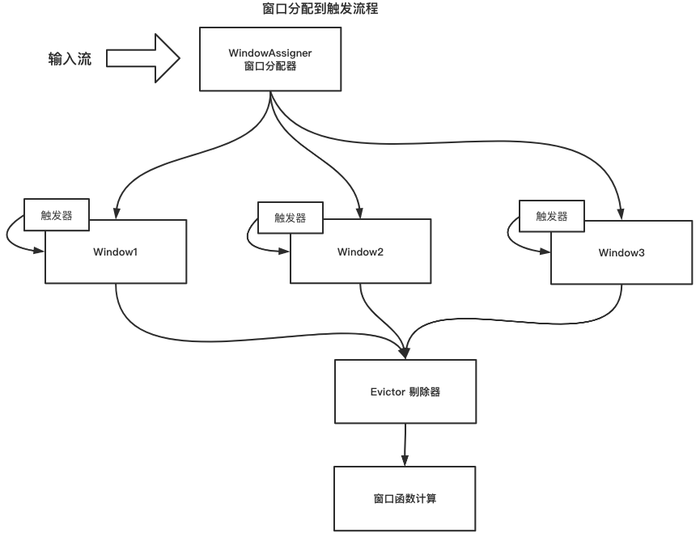

## 概述  
窗口操作分为时间窗口和计数窗口，所有的窗口操作的元素均有WindowAssigner、Window、Trigger、
Evictor和窗口计算函数组成。   
 
##窗口分配到触发过程  
1. WindowAssigner将输入流分配到对应的窗口；  
2. 在触发器满足对应的触发条件后，直接触发窗口计算；  
3. Evictor剔除器，剔除指定的元素；   
4. 窗口计算函数，数据最终处理方法；  
  

## WindowAssigner  
WindowAssigner是按照规则将数据分配到对应窗口中，实现类对象如下图  
  

## Trigger  
触发器定义了在在什么时机触发窗口计算，Trigger接口核心的方法有onElement，onProcessingTime，onEventTime  
```java
public abstract class Trigger<T, W extends Window> implements Serializable {
    // 在每个元素分配到窗口时，都会触发onElement方法（WindowOperator中调用），来做相关操作，例如处理时间会注册对应的定时器，事件时间会判断当前WaterMark是否满足触发条件
    // 计数窗口会计算当前窗口数量
	public abstract TriggerResult onElement(T element, long timestamp, W window, TriggerContext ctx) throws Exception;
    // 定义了到处理时间后，Trigger的状态，Trigger的状态如果是Fire，那么此时会获取窗口数据，并进行计算
	public abstract TriggerResult onProcessingTime(long time, W window, TriggerContext ctx) throws Exception;
	// 定义了到事件事件后，Trigger的状态，Trigger的状态如果为Fire，那么此时会获取窗口数据，并计算
	public abstract TriggerResult onEventTime(long time, W window, TriggerContext ctx) throws Exception;
}
```  
  

## Evictor剔除器  
剔除器的实现包括计数剔除器（CountEvictor，保存用户指定的元素，剔除缓冲区开始的部分元素），
Delta剔除器（DeltaEvictor，获取一个DeltaFunction和一个阈值，计算窗口缓冲区中最后一个元素和每个剩余元素之间的增量，并删除增量大于或等于阈值的元素），
基于时间剔除器（TimeEvictor，以毫秒为单位的时间间隔作为参数，对于给定的窗口，它找到其元素中的最大时间戳max_ts，并删除所有时间戳小于max_ts - interval的元素）  


