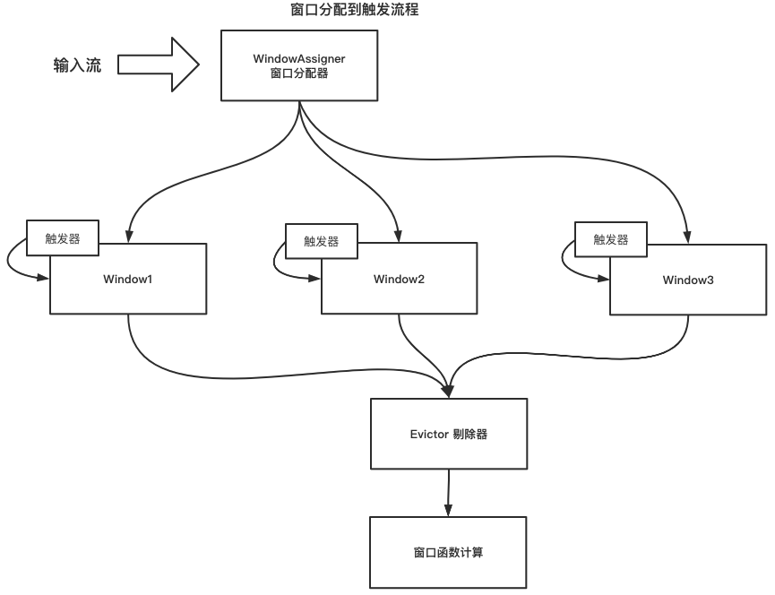

# 处理时间窗口工作过程  
## 概述  
处理时间窗口是将输入流按照系统时间拆分成多个时间窗口，数据通过windowAssigner分配到不同的
窗口下，并注册窗口定时器，在指定时间内触发窗口操作；   
 

## 概念  
**Window**  
Window是Flink窗口的概念，窗口分为时间窗口和全局窗口，*时间窗口*的属性有start，end标示窗口的起始和结束时间；*全局窗口*是全局窗口，
窗口，所有的数据均会放置在这个窗口中，所以并行度只能为1；  
```java
public class TimeWindow {
    // 定义了窗口的起始和结束时间  
	public TimeWindow(long start, long end) {
		this.start = start;
		this.end = end;
	}
}
```

**WindowAssigner**  
该对象是分配元素到不同的时间窗口，时间窗口有start和end两个时间属性，WindowAssigner在WindowOperator
接收到每个元素时都会为该元素分配一个处理时间窗口。  

notice：窗口分配规则  

timestamp - (timestamp - offset + windowSize) % windowSize

## 处理时间窗口操作实现流程描述  
1. 每来一条数据，先通过windowAssigner将每个StreamRecord按照系统处理时间生成TimeWindow；  
2. 遍历所有窗口，将StreamRecord放在合适的windowState；  
3. 按照窗口的结束时间（开区间）注册定时器；  
4. 定时器到指定延迟后，回调WindowOperator.onProcessTime方法，取出对应的窗口并调用用户定义的处理方法；    

## 源码实现  
### WindowStream转换成SingleOutputStreamOperator   
```java
public class WindowStream {
	@Internal
	public <R> SingleOutputStreamOperator<R> process(ProcessWindowFunction<T, R, K, W> function, TypeInformation<R> resultType) {
		function = input.getExecutionEnvironment().clean(function);
		return apply(new InternalIterableProcessWindowFunction<>(function), resultType, function);
	}
	// WindowStream.apply
	private <R> SingleOutputStreamOperator<R> apply(InternalWindowFunction<Iterable<T>, R, K, W> function, TypeInformation<R> resultType, Function originalFunction) {
		// 生成操作名称，同时将keySelector获取出来
		final String opName = generateOperatorName(windowAssigner, trigger, evictor, originalFunction, null);
		KeySelector<T, K> keySel = input.getKeySelector();

		WindowOperator<K, T, Iterable<T>, R, W> operator;
		// 构建WindowOperator
		if (evictor != null) {
			@SuppressWarnings({"unchecked", "rawtypes"})
			TypeSerializer<StreamRecord<T>> streamRecordSerializer =
					(TypeSerializer<StreamRecord<T>>) new StreamElementSerializer(input.getType().createSerializer(getExecutionEnvironment().getConfig()));
			// 构建状态缓存window数据
			ListStateDescriptor<StreamRecord<T>> stateDesc =
					new ListStateDescriptor<>("window-contents", streamRecordSerializer);
			// 实例化WindowOperator
			operator =
				new EvictingWindowOperator<>(windowAssigner,
					windowAssigner.getWindowSerializer(getExecutionEnvironment().getConfig()),
					keySel,
					input.getKeyType().createSerializer(getExecutionEnvironment().getConfig()),
					stateDesc,
					function,
					trigger,
					evictor,
					allowedLateness,
					lateDataOutputTag);

		} else { // 通过ListStateDescriptor来存储window的内容
			ListStateDescriptor<T> stateDesc = new ListStateDescriptor<>("window-contents",
				input.getType().createSerializer(getExecutionEnvironment().getConfig()));
			// 构建WindowOperator
			operator =
				new WindowOperator<>(windowAssigner,
					windowAssigner.getWindowSerializer(getExecutionEnvironment().getConfig()),
					keySel,
					input.getKeyType().createSerializer(getExecutionEnvironment().getConfig()),
					stateDesc,
					function,
					trigger,
					allowedLateness,
					lateDataOutputTag);
		}
		// 将operator增加到Env的transformations对象中
		return input.transform(opName, resultType, operator);
	}
}
```  

### WindowOperator处理每条数据流程  
```java
class WindowOperator {
	public void processElement(StreamRecord<IN> element) throws Exception {
		final Collection<W> elementWindows = windowAssigner.assignWindows( // 为每个元素通过WindowAssigner分配时间窗口
			element.getValue(), element.getTimestamp(), windowAssignerContext);

		//if element is handled by none of assigned elementWindows
		boolean isSkippedElement = true;

		final K key = this.<K>getKeyedStateBackend().getCurrentKey();
		// todo: 了解一下MergeWindowAssigner的场景
		if (windowAssigner instanceof MergingWindowAssigner) {
			MergingWindowSet<W> mergingWindows = getMergingWindowSet();

			for (W window: elementWindows) {

				// adding the new window might result in a merge, in that case the actualWindow
				// is the merged window and we work with that. If we don't merge then
				// actualWindow == window
				W actualWindow = mergingWindows.addWindow(window, new MergingWindowSet.MergeFunction<W>() {
					@Override
					public void merge(W mergeResult,
							Collection<W> mergedWindows, W stateWindowResult,
							Collection<W> mergedStateWindows) throws Exception {

						if ((windowAssigner.isEventTime() && mergeResult.maxTimestamp() + allowedLateness <= internalTimerService.currentWatermark())) {
							throw new UnsupportedOperationException("The end timestamp of an " +
									"event-time window cannot become earlier than the current watermark " +
									"by merging. Current watermark: " + internalTimerService.currentWatermark() +
									" window: " + mergeResult);
						} else if (!windowAssigner.isEventTime()) {
							long currentProcessingTime = internalTimerService.currentProcessingTime();
							if (mergeResult.maxTimestamp() <= currentProcessingTime) {
								throw new UnsupportedOperationException("The end timestamp of a " +
									"processing-time window cannot become earlier than the current processing time " +
									"by merging. Current processing time: " + currentProcessingTime +
									" window: " + mergeResult);
							}
						}

						triggerContext.key = key;
						triggerContext.window = mergeResult;

						triggerContext.onMerge(mergedWindows);

						for (W m: mergedWindows) {
							triggerContext.window = m;
							triggerContext.clear();
							deleteCleanupTimer(m);
						}

						// merge the merged state windows into the newly resulting state window
						windowMergingState.mergeNamespaces(stateWindowResult, mergedStateWindows);
					}
				});

				// drop if the window is already late
				if (isWindowLate(actualWindow)) {
					mergingWindows.retireWindow(actualWindow);
					continue;
				}
				isSkippedElement = false;

				W stateWindow = mergingWindows.getStateWindow(actualWindow);
				if (stateWindow == null) {
					throw new IllegalStateException("Window " + window + " is not in in-flight window set.");
				}

				windowState.setCurrentNamespace(stateWindow);
				windowState.add(element.getValue());

				triggerContext.key = key;
				triggerContext.window = actualWindow;

				TriggerResult triggerResult = triggerContext.onElement(element);

				if (triggerResult.isFire()) {
					ACC contents = windowState.get();
					if (contents == null) {
						continue;
					}
					emitWindowContents(actualWindow, contents);
				}

				if (triggerResult.isPurge()) {
					windowState.clear();
				}
				registerCleanupTimer(actualWindow);
			}

			// need to make sure to update the merging state in state
			mergingWindows.persist();
		} else {
			for (W window: elementWindows) {

				// 判断窗口是否延迟，如果延迟则丢弃
				if (isWindowLate(window)) {
					continue;
				}
				isSkippedElement = false;
				// 窗口中间数据存储到状态缓存中，todo：查看一下ListState状态缓存结构
				windowState.setCurrentNamespace(window);
				windowState.add(element.getValue());

				triggerContext.key = key;
				triggerContext.window = window;
				// 为每个窗口（todo：看一下窗口注册定时器的逻辑）注册定时器
				TriggerResult triggerResult = triggerContext.onElement(element);
				// 处理时间均返回的Continue信息
				if (triggerResult.isFire()) {
					ACC contents = windowState.get();
					if (contents == null) {
						continue;
					}
					emitWindowContents(window, contents);
				}

				if (triggerResult.isPurge()) {
					windowState.clear();
				}
				registerCleanupTimer(window);
			}
		}
		// 对哪些跳过的数据或延迟数据如果设定了旁路输出，则放到旁路输出中
		// side output input event if
		// element not handled by any window
		// late arriving tag has been set
		// windowAssigner is event time and current timestamp + allowed lateness no less than element timestamp
		if (isSkippedElement && isElementLate(element)) {
			if (lateDataOutputTag != null){
				sideOutput(element);
			} else {
				this.numLateRecordsDropped.inc();
			}
		}
	}
	// 为窗口注册处理时间定时器  
    @Override
	public void registerProcessingTimeTimer(long time) {
	    internalTimerService.registerProcessingTimeTimer(window, time);
	}

	// 处理时间触发
	@Override
	public void onProcessingTime(InternalTimer<K, W> timer) throws Exception {
		triggerContext.key = timer.getKey();
		triggerContext.window = timer.getNamespace();

		MergingWindowSet<W> mergingWindows;

		if (windowAssigner instanceof MergingWindowAssigner) {
			mergingWindows = getMergingWindowSet();
			W stateWindow = mergingWindows.getStateWindow(triggerContext.window);
			if (stateWindow == null) {
				// Timer firing for non-existent window, this can only happen if a
				// trigger did not clean up timers. We have already cleared the merging
				// window and therefore the Trigger state, however, so nothing to do.
				return;
			} else {
				windowState.setCurrentNamespace(stateWindow);
			}
		} else {
			windowState.setCurrentNamespace(triggerContext.window);
			mergingWindows = null;
		}

		TriggerResult triggerResult = triggerContext.onProcessingTime(timer.getTimestamp());

		if (triggerResult.isFire()) {
            // 获取windowState中的StreamRecords
			ACC contents = windowState.get(); 
			if (contents != null) {
			    // 处理用户操作逻辑
				emitWindowContents(triggerContext.window, contents);
			}
		}
		// 窗口状态清理
		if (triggerResult.isPurge()) {
			windowState.clear();
		}

		if (!windowAssigner.isEventTime() && isCleanupTime(triggerContext.window, timer.getTimestamp())) {
			clearAllState(triggerContext.window, windowState, mergingWindows);
		}

		if (mergingWindows != null) {
			// need to make sure to update the merging state in state
			mergingWindows.persist();
		}
	}
    // 用户操作窗口内所有数据
	private void emitWindowContents(W window, ACC contents) throws Exception {
		timestampedCollector.setAbsoluteTimestamp(window.maxTimestamp());
		processContext.window = window;
        // 执行process方法  
		userFunction.process(triggerContext.key, window, processContext, contents, timestampedCollector);
	}

}
```  
### 处理时间定时器注册  
```java
public class InternalTimerServiceImpl {
	public void registerProcessingTimeTimer(N namespace, long time) {
		// 获取processingTimeTimersQueue的最新触发时间的定时器，按照窗口结束时间的优先级顺序
		InternalTimer<K, N> oldHead = processingTimeTimersQueue.peek();
		// 将新增加的触发时间加入到队列中
		if (processingTimeTimersQueue.add(new TimerHeapInternalTimer<>(time, (K) keyContext.getCurrentKey(), namespace))) {
			// 如果获取最近一次的触发时间
			long nextTriggerTime = oldHead != null ? oldHead.getTimestamp() : Long.MAX_VALUE;
			// check if we need to re-schedule our timer to earlier
			// 如果新加入的触发时间小于最近一次触发时间 (在处理滚动窗口模式下，触发是顺序执行的，且不重叠，所以time始终是小于nextTriggerTime)
			// 即：每来一个新窗口后，都会在这里注册触发定时器，并在指定延迟后回调用户定义的函数
			if (time < nextTriggerTime) {
				System.out.println("InternalTimerService registerProcessingTimeTimer ========= time: " + time + ", nextTriggerTime: " + nextTriggerTime);
				if (nextTimer != null) {
					nextTimer.cancel(false);
				} // 设置下一次触发时间为当前加入元素的触发时间，并注册回调方法
				nextTimer = processingTimeService.registerTimer(time, this::onProcessingTime);
				System.out.println("InternalTimerService registerProcessingTimeTimer ============= time: " + time);
			}
		}
	}
	// 基于处理时间的回调方法  
	private void onProcessingTime(long time) throws Exception {
		// null out the timer in case the Triggerable calls registerProcessingTimeTimer()
		// inside the callback.
		nextTimer = null;

		InternalTimer<K, N> timer;
		// 循环从处理时间定时器队列中取出当前时间需要触发的InternalTimer，并且执行用户自定义的处理方法  
		while ((timer = processingTimeTimersQueue.peek()) != null && timer.getTimestamp() <= time) {
			processingTimeTimersQueue.poll();
			keyContext.setCurrentKey(timer.getKey());
            // 
			triggerTarget.onProcessingTime(timer);
		}
		// 注册处理时间定时器，注册下一次最近要执行的定时器  
		if (timer != null && nextTimer == null) {
			nextTimer = processingTimeService.registerTimer(timer.getTimestamp(), this::onProcessingTime);
			System.out.println("InternalTimerService onProcessingTime ============= time: " + time);
		}
	}
}
```

## 参考demo  
### demo    
```java
public class ProcessTimeWindowTest {
	public static void main(String[] args) throws Exception {
		// 构建StreamExecutionEnvironment
		StreamExecutionEnvironment env = StreamExecutionEnvironment.getExecutionEnvironment();
		// 设置执行环境窗口时间为处理时间
		env.setStreamTimeCharacteristic(TimeCharacteristic.ProcessingTime);
		// 构建输入数据源
		DataStream<Tuple2<String, Long>> inputDataStream = env.addSource(new TimeDataSource());
		// flatMap操作构建DataStream
		DataStream<Tuple3<String, Long, Integer>> flatMapStream = inputDataStream.flatMap(new TimeDataFlatMap());
		// DataStream
		// flatMapStream.windowAll() && flatMapStream.window
		// 通过keyBy Transform转换成keyStream
		KeyedStream<Tuple3<String, Long, Integer>, String> keyedStream = flatMapStream.keyBy(t -> t.f0);
		// WindowedStream.process() 背后也是走的 WindowedStream.apply()
		// 窗口操作
		keyedStream.timeWindow(Time.seconds(3)).apply(new TimeDataWindowFunction());
		// 开始执行
		env.execute(ProcessTimeWindowTest.class.getSimpleName());
	}
}
```  
### 结果输出  
```shell script
TimeWindow: [timestamp = 1608968569416],[offset = 0],[windowSize = 3000], [windowStart = 1608968568000]
TimeWindow: [timestamp = 1608968570447],[offset = 0],[windowSize = 3000], [windowStart = 1608968568000]
this in TimeWindow{start=1608968568000, end=1608968571000}========[(aa,1608033600000,1), (aa,1608033640000,1)]
TimeWindow: [timestamp = 1608968571377],[offset = 0],[windowSize = 3000], [windowStart = 1608968571000]
TimeWindow: [timestamp = 1608968572306],[offset = 0],[windowSize = 3000], [windowStart = 1608968571000]
TimeWindow: [timestamp = 1608968573340],[offset = 0],[windowSize = 3000], [windowStart = 1608968571000]
this in TimeWindow{start=1608968571000, end=1608968574000}========[(aa,1608033640000,1), (aa,1608033650000,1), (aa,1608033630000,1)]
TimeWindow: [timestamp = 1608968574363],[offset = 0],[windowSize = 3000], [windowStart = 1608968574000]
InternalTimerService registerProcessingTimeTimer ========= time: 1608968576999, nextTriggerTime: 9223372036854775807
InternalTimerService registerProcessingTimeTimer ============= time: 1608968576999 # 这个很巧妙，定义的触发时间是1608968579999 触发的窗口时间是1608968577000 来提高窗口精度
TimeWindow: [timestamp = 1608968575390],[offset = 0],[windowSize = 3000], [windowStart = 1608968574000]
TimeWindow: [timestamp = 1608968576406],[offset = 0],[windowSize = 3000], [windowStart = 1608968574000]
this in TimeWindow{start=1608968574000, end=1608968577000}========[(aa,1608033700000,1), (aa,1608033710000,1), (aa,1608033720000,1)]
TimeWindow: [timestamp = 1608968577445],[offset = 0],[windowSize = 3000], [windowStart = 1608968577000]
```